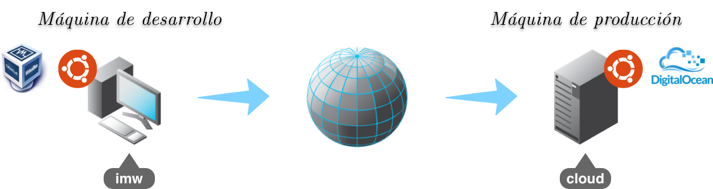

# Máquina de desarrollo

Para trabajar en esta asignatura necesitaremos dos máquinas: **máquina de desarrollo** y **máquina de producción**:

 

## Instalación

Usaremos una *máquina virtual* como *máquina de desarrollo*. Esta máquina tendrá sistema operativo Linux 64 bits, con las siguientes características:

- **Distribución**: `Ubuntu 18.04.3 Desktop LTS (Bionic Beaver)`
    - [Enlace para descargar iso desde la web de Ubuntu](http://releases.ubuntu.com/18.04/ubuntu-18.04.3-desktop-amd64.iso)
    - La *.iso* también está disponible [en el servidor Leela](http://172.20.1.2/~general/software/sistemas-operativos/isos/ubuntu/ubuntu-18.04.3-desktop-amd64.iso).
- **Tamaño del disco duro**: 25GB.
- **Memoria**: 2GB.
- **Nombre de la máquina**: `imw<expediente>` (ej. *imw3421*) Así evitamos conflictos del mismo nombre de máquina en la red local.
- **Nombre de usuario**: `alu<expediente>` (ej. *alu3421*)

> **NOTA**: Puede que haya problemas de **"freezing"** con VirtualBox y máquinas virtuales Ubuntu 18.04. Si esto pasa, se recomienda cambiar el *adaptador de red* de la máquina virtual a **NAT**.

> Realizar **instalación mínima** y **desactivar actualizaciones**.
