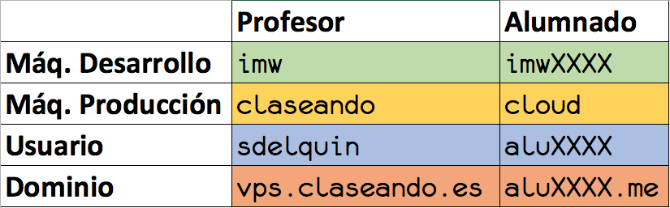

# Configuración de la máquina de producción

## Aclaración sobre usuarios y dominios

 

## Acceso por nombre de dominio

Si en el momento de hacer estos ajustes, aún no tuviéramos acceso a `cloud` a través del dominio `aluXXXX.me`, tendremos que acceder a través de la IP X.X.X.X correspondiente a la máquina de producción de *Digital Ocean*.

## Ajuste de locales

Accedemos a la **máquina de producción**:

~~~console
sdelquin@imw:~$ ssh root@vps.claseando.es
The authenticity of host 'vps.claseando.es (207.154.234.62)' can't be established.
ECDSA key fingerprint is SHA256:aQzjNpUQjJdYGVxk7OsPpq+O1a4x0OMrkAWcwQBu3Qk.
Are you sure you want to continue connecting (yes/no)? yes
Warning: Permanently added 'vps.claseando.es,207.154.234.62' (ECDSA) to the list of known hosts.
root@vps.claseando.es's password:
Welcome to Ubuntu 18.04.1 LTS (GNU/Linux 4.15.0-30-generic x86_64)

 * Documentation:  https://help.ubuntu.com
 * Management:     https://landscape.canonical.com
 * Support:        https://ubuntu.com/advantage

  System information as of Sun Sep 16 10:40:23 UTC 2018

  System load:  0.0               Processes:           84
  Usage of /:   6.3% of 24.06GB   Users logged in:     0
  Memory usage: 19%               IP address for eth0: 207.154.234.62
  Swap usage:   0%

  Get cloud support with Ubuntu Advantage Cloud Guest:
    http://www.ubuntu.com/business/services/cloud

 * Canonical Livepatch is available for installation.
   - Reduce system reboots and improve kernel security. Activate at:
     https://ubuntu.com/livepatch

24 packages can be updated.
0 updates are security updates.

Failed to connect to https://changelogs.ubuntu.com/meta-release-lts. Check your Internet connection or proxy settings

*** System restart required ***
Last login: Sun Sep  9 19:40:50 2018 from 81.37.146.239
-bash: warning: setlocale: LC_ALL: cannot change locale (es_ES.UTF-8)
root@claseando:~#
~~~

Para solucionar los *locales*, debemos ejecutar los siguientes comandos:

~~~console
root@claseando:~# sudo locale-gen es_ES.UTF-8
/bin/bash: warning: setlocale: LC_ALL: cannot change locale (es_ES.UTF-8)
Generating locales (this might take a while)...
  es_ES.UTF-8... done
Generation complete.
root@claseando:~# sudo update-locale LANG=es_ES.UTF-8
root@claseando:~#
~~~

## Creación de usuario

**Digital Ocean** nos da acceso de `root` a la máquina, pero vamos a crear un usuario distinto. Para ello, debemos ejecutar el siguiente comando pero con el nombre de usuario `alu<expendiente>`.

~~~console
root@claseando:~# adduser sdelquin
Adding user `sdelquin' ...
Adding new group `sdelquin' (1000) ...
Adding new user `sdelquin' (1000) with group `sdelquin' ...
Creating home directory `/home/sdelquin' ...
Copying files from `/etc/skel' ...
Enter new UNIX password:
Retype new UNIX password:
passwd: password updated successfully
Changing the user information for sdelquin
Enter the new value, or press ENTER for the default
	Full Name []: Sergio Delgado Quintero
	Room Number []:
	Work Phone []:
	Home Phone []:
	Other []:
Is the information correct? [Y/n]
root@claseando:~#
~~~

Ahora sólo nos falta dar permisos de `sudo` al usuario creado:

~~~console
root@claseando:~# adduser sdelquin sudo
Adding user `sdelquin' to group `sudo' ...
Adding user sdelquin to group sudo
Done.
root@claseando:~#
~~~

## Acceso por SSH (sin password)

Cada vez que queramos entrar a la máquina de producción vía `ssh` nos va a solicitar la contraseña. A continuación vamos a realizar un procedimiento que nos permite entrar sin la necesidad de poner una contraseña explícitamente.

### Creación de claves RSA

En la *máquina de desarrollo* creamos las claves *RSA*:

~~~console
sdelquin@imw:~$ ssh-keygen
Generating public/private rsa key pair.
Enter file in which to save the key (/home/sdelquin/.ssh/id_rsa):
Enter passphrase (empty for no passphrase):
Enter same passphrase again:
Your identification has been saved in /home/sdelquin/.ssh/id_rsa.
Your public key has been saved in /home/sdelquin/.ssh/id_rsa.pub.
The key fingerprint is:
SHA256:OrXGPr+faKUK54MIGxKPN5cV15ISY7QuAN36uGRUDyw sdelquin@imw
The key's randomart image is:
+---[RSA 2048]----+
|.. o .=. o       |
| .E =.oo+ .      |
|  .+ o.+ .       |
|. o. .o          |
| = o.o. S        |
|o X +. + .  .    |
| = B .+.=  o     |
|  o . .Bo o. .   |
|        +*+oo    |
+----[SHA256]-----+
sdelquin@imw:~$
~~~

### Copia de clave pública

Ahora copiamos la **clave pública** `id_rsa.pub` a la *máquina de producción*:

~~~console
sdelquin@imw:~$ ssh-copy-id vps.claseando.es
/usr/bin/ssh-copy-id: INFO: Source of key(s) to be installed: "/home/sdelquin/.ssh/id_rsa.pub"
/usr/bin/ssh-copy-id: INFO: attempting to log in with the new key(s), to filter out any that are already installed
/usr/bin/ssh-copy-id: INFO: 1 key(s) remain to be installed -- if you are prompted now it is to install the new keys
sdelquin@vps.claseando.es's password:

Number of key(s) added: 1

Now try logging into the machine, with:   "ssh 'vps.claseando.es'"
and check to make sure that only the key(s) you wanted were added.

sdelquin@imw:~$
~~~

Ahora deberíamos poder entrar en la *máquina de producción* sin necesidad de poner nuestra contraseña:

~~~console
sdelquin@imw:~$ ssh vps.claseando.es
Welcome to Ubuntu 18.04.1 LTS (GNU/Linux 4.15.0-34-generic x86_64)

 * Documentation:  https://help.ubuntu.com
 * Management:     https://landscape.canonical.com
 * Support:        https://ubuntu.com/advantage

  System information as of Sun Sep 16 10:49:49 UTC 2018

  System load:  0.52              Processes:           87
  Usage of /:   6.3% of 24.06GB   Users logged in:     0
  Memory usage: 14%               IP address for eth0: 207.154.234.62
  Swap usage:   0%

  Get cloud support with Ubuntu Advantage Cloud Guest:
    http://www.ubuntu.com/business/services/cloud

 * Canonical Livepatch is available for installation.
   - Reduce system reboots and improve kernel security. Activate at:
     https://ubuntu.com/livepatch

24 packages can be updated.
0 updates are security updates.

Failed to connect to https://changelogs.ubuntu.com/meta-release-lts. Check your Internet connection or proxy settings

Last login: Sun Sep 16 10:49:17 2018 from 88.27.15.116
sdelquin@claseando:~$
~~~

## Dando un nombre más sencillo

Para evitar tener que poner cada vez el nombre completo de dominio de la máquina de producción, podemos usar un *alias* desde nuestra máquina de desarrollo:

~~~console
sdelquin@imw:~$ sudo vi /etc/hosts
...
~~~

Añadir la siguiente información al final del fichero:
~~~console
207.154.234.62  claseando
~~~
> **OJO!** En tu caso habría que poner `cloud` y la **IP** de tu máquina de producción.

### Acceso con alias

Comprobamos que el alias creado apunta a la dirección correcta:

~~~console
sdelquin@imw:~$ ping -c1 claseando
PING claseando (207.154.234.62) 56(84) bytes of data.
64 bytes from claseando (207.154.234.62): icmp_seq=1 ttl=52 time=62.0 ms

--- claseando ping statistics ---
1 packets transmitted, 1 received, 0% packet loss, time 0ms
rtt min/avg/max/mdev = 62.029/62.029/62.029/0.000 ms
sdelquin@imw:~$
~~~

Ahora podemos acceder a la *máquina de producción* utilizando el nombre `claseando`:

~~~console
sdelquin@imw:~$ ssh claseando
The authenticity of host 'claseando (207.154.234.62)' can't be established.
ECDSA key fingerprint is SHA256:aQzjNpUQjJdYGVxk7OsPpq+O1a4x0OMrkAWcwQBu3Qk.
Are you sure you want to continue connecting (yes/no)? yes
Warning: Permanently added 'claseando' (ECDSA) to the list of known hosts.
Welcome to Ubuntu 18.04.1 LTS (GNU/Linux 4.15.0-34-generic x86_64)

 * Documentation:  https://help.ubuntu.com
 * Management:     https://landscape.canonical.com
 * Support:        https://ubuntu.com/advantage

  System information as of Sun Sep 16 10:57:34 UTC 2018

  System load:  0.0               Processes:           84
  Usage of /:   6.3% of 24.06GB   Users logged in:     0
  Memory usage: 12%               IP address for eth0: 207.154.234.62
  Swap usage:   0%

  Get cloud support with Ubuntu Advantage Cloud Guest:
    http://www.ubuntu.com/business/services/cloud

 * Canonical Livepatch is available for installation.
   - Reduce system reboots and improve kernel security. Activate at:
     https://ubuntu.com/livepatch

24 packages can be updated.
0 updates are security updates.

Failed to connect to https://changelogs.ubuntu.com/meta-release-lts. Check your Internet connection or proxy settings

Last login: Sun Sep 16 10:49:51 2018 from 88.27.15.116
sdelquin@claseando:~$
~~~

## Personalización del prompt

[.bashrc PS1 generator](http://bashrcgenerator.com/)

## Paquetes necesarios

Instalación de paquetes necesarios en el futuro:

~~~console
sdelquin@claseando:~$ sudo apt install -y tree
~~~
