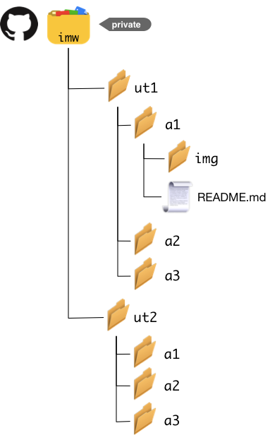

# Repositorio para actividades

Una vez activado el *Student Developer Pack*, ya tendremos la posibilidad de crear repositorios privados ilimitados.

Para la entrega de las actividades de la asignatura, debemos crear un **REPOSITORIO PRIVADO** llamado `imw` con la siguiente estructura de *unidades de trabajo* y *actividades*:

 

> **NOTA**: Dado que el repositorio que están creando es privado, me deben dar **acceso para evaluar las actividades**. Para ello, dentro del repositorio `imw` de GitHub van a `Settings -> Collaborators -> Add collaborator` y me buscan por el alias `sdelquin`.

## Entrega de informes/codigo

En el caso de que hubiera que entregar **informes**, estos se harán en un documento `README.md` con estilo *markdown*. Si hubiera que entregar **código**, el propio código se incluirá en la carpeta correspondiente.

La URL que deben subir a la actividad es el **enlace al commit** del fichero (ó ficheros) que se quieran entregar. Aquí les dejo un vídeotutorial:

