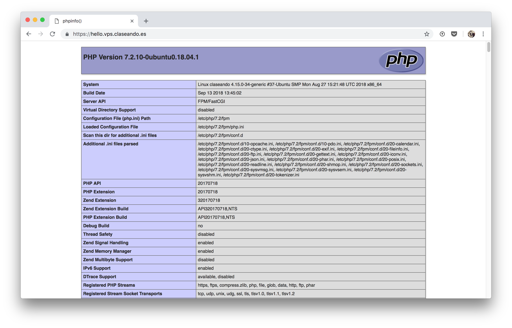

# Configuración de PHP

**PHP** es un lenguaje de programación, ampliamente utilizado en la creación de contenido web.

 

## Instalación

Aunque ya hemos instalado [el servidor web Nginx](../webserver), necesitamos un módulo adicional que procese el lenguaje PHP.

Existen varios módulos de procesamiento de PHP, pero el más usado es [php-fpm](https://php-fpm.org/)  (FastCGI Process Manager). Para su instalación usaremos el paquete `php-fpm` disponible en los repositorios de *apt*:

~~~console
sdelquin@claseando:~$ sudo apt install -y php-fpm
Leyendo lista de paquetes... Hecho
Creando árbol de dependencias
Leyendo la información de estado... Hecho
El paquete indicado a continuación se instaló de forma automática y ya no es necesario.
  grub-pc-bin
Utilice «sudo apt autoremove» para eliminarlo.
Se instalarán los siguientes paquetes adicionales:
  libsodium23 php-common php7.2-cli php7.2-common php7.2-fpm php7.2-json php7.2-opcache php7.2-readline
Paquetes sugeridos:
Creating config file /etc/php/7.2/mods-available/readline.ini with new version
Configurando php7.2-json (7.2.10-0ubuntu0.18.04.1) ...

Creating config file /etc/php/7.2/mods-available/json.ini with new version
Configurando php7.2-opcache (7.2.10-0ubuntu0.18.04.1) ...

Creating config file /etc/php/7.2/mods-available/opcache.ini with new version
Configurando php7.2-cli (7.2.10-0ubuntu0.18.04.1) ...
update-alternatives: utilizando /usr/bin/php7.2 para proveer /usr/bin/php (php) en modo automático
update-alternatives: utilizando /usr/bin/phar7.2 para proveer /usr/bin/phar (phar) en modo automático
update-alternatives: utilizando /usr/bin/phar.phar7.2 para proveer /usr/bin/phar.phar (phar.phar) en modo automático

Creating config file /etc/php/7.2/cli/php.ini with new version
Configurando php7.2-fpm (7.2.10-0ubuntu0.18.04.1) ...

Creating config file /etc/php/7.2/fpm/php.ini with new version
Created symlink /etc/systemd/system/multi-user.target.wants/php7.2-fpm.service → /lib/systemd/system/php7.2-fpm.service.
Configurando php-fpm (1:7.2+60ubuntu1) ...
Procesando disparadores para ureadahead (0.100.0-20) ...
Procesando disparadores para systemd (237-3ubuntu10.3) ...
sdelquin@claseando:~$
~~~

Tras la instalación podemos comprobar que está funcionando correctamente:

~~~console
sdelquin@claseando:~$ sudo systemctl status php7.2-fpm
● php7.2-fpm.service - The PHP 7.2 FastCGI Process Manager
   Loaded: loaded (/lib/systemd/system/php7.2-fpm.service; enabled; vendor preset: enabled)
   Active: active (running) since Fri 2018-10-05 08:53:34 UTC; 4min 45s ago
     Docs: man:php-fpm7.2(8)
 Main PID: 28821 (php-fpm7.2)
   Status: "Processes active: 0, idle: 2, Requests: 0, slow: 0, Traffic: 0req/sec"
    Tasks: 3 (limit: 1152)
   CGroup: /system.slice/php7.2-fpm.service
           ├─28821 php-fpm: master process (/etc/php/7.2/fpm/php-fpm.conf)
           ├─28833 php-fpm: pool www
           └─28834 php-fpm: pool www

oct 05 08:53:34 claseando systemd[1]: Starting The PHP 7.2 FastCGI Process Manager...
oct 05 08:53:34 claseando systemd[1]: Started The PHP 7.2 FastCGI Process Manager.
sdelquin@claseando:~$
~~~

## Configuración

A continuación tenemos que indicarle al servidor web, en este caso **Nginx**, que debe utilizar el módulo `php-fpm` cuando vaya a manejar ficheros `.php`.

Supongamos que queremos interpretar ficheros `.php` desde nuestra primera web `hello.vps.claseando.es`. Para ello, debemos realizar los siguientes pasos:

~~~console
sdelquin@claseando:~$ sudo vi /etc/nginx/sites-available/hello.vps.claseando.es
...
~~~

~~~nginx
server {
    server_name hello.vps.claseando.es;
    root /home/sdelquin/webapps/hello;


    listen 443 ssl; # managed by Certbot
    ssl_certificate /etc/letsencrypt/live/hello.vps.claseando.es/fullchain.pem; # managed by Certbot
    ssl_certificate_key /etc/letsencrypt/live/hello.vps.claseando.es/privkey.pem; # managed by Certbot
    include /etc/letsencrypt/options-ssl-nginx.conf; # managed by Certbot
    ssl_dhparam /etc/letsencrypt/ssl-dhparams.pem; # managed by Certbot

    # ---> php file handling through php-fpm
    location ~ \.php {
        include snippets/fastcgi-php.conf;
        fastcgi_pass unix:/run/php/php7.2-fpm.sock;
    }
    # <---
}

server {
    if ($host = hello.vps.claseando.es) {
        return 301 https://$host$request_uri;
    } # managed by Certbot


    server_name hello.vps.claseando.es;
    listen 80;
    return 404; # managed by Certbot
}
~~~

Ya sólo nos falta recargar el servidor web:

```console
sdelquin@claseando:~$ sudo systemctl reload nginx
sdelquin@claseando:~$
```

## Comprobación de funcionamiento

Vamos a crear un fichero sencillo en *php* en el root de nuestro sitio web para comprobar el funcionamiento:

```console
sdelquin@claseando:~$ echo '<?php phpinfo(); ?>' > webapps/hello/test.php
sdelquin@claseando:~$
```

A continuación, accedemos al fichero creado a través de un navegador web:


## Acceso por fichero de índice

Supongamos que queremos que se nos muestre el fichero `php` cuando accedemos a una carpeta. Para ello debemos hacer lo siguiente:

Renombramos el fichero a `index.php`:

~~~console
sdelquin@claseando:~$ cd webapps/hello/
sdelquin@claseando:~/webapps/hello$ ls
index.html  test.php
sdelquin@claseando:~/webapps/hello$ mv test.php index.php
sdelquin@claseando:~/webapps/hello$
~~~

Editamos el virtual host que habíamos creado:

~~~console
sdelquin@claseando:~$ sudo vi /etc/nginx/sites-available/hello.vps.claseando.es
...
~~~

~~~nginx
server {
    server_name hello.vps.claseando.es;
    root /home/sdelquin/webapps/hello;

    # ----> index files
    index index.php;

    ...
}
~~~

Estamos obligando a que el fichero índice sea `index.php`, mientras que anteriormente el fichero índice era, por defecto, `index.html`.

Recargamos el servidor web Nginx para que surtan efecto los cambios:

~~~console
sdelquin@claseando:~$ sudo systemctl reload nginx
sdelquin@claseando:~$
~~~

Y ahora accedemos directamente al raíz de nuestro dominio:


