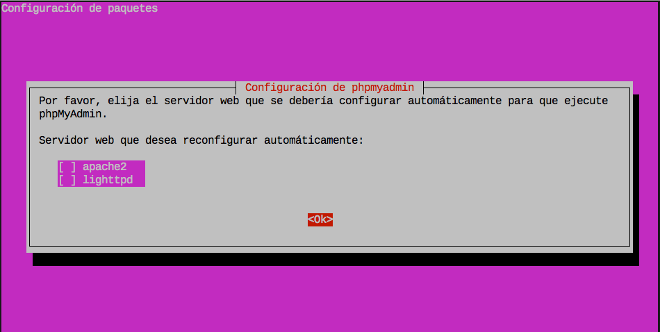
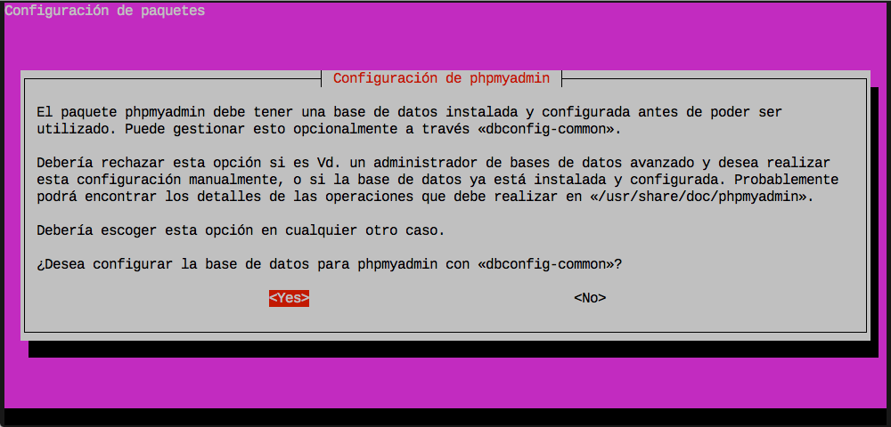
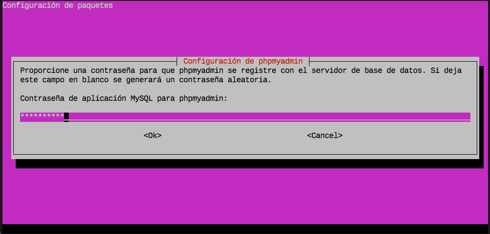
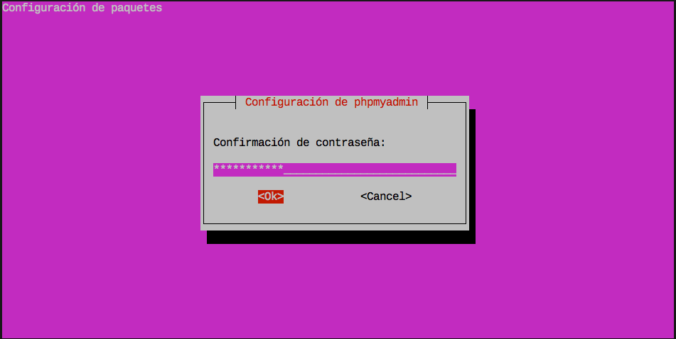
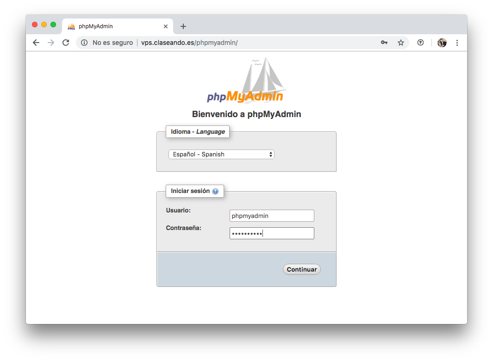
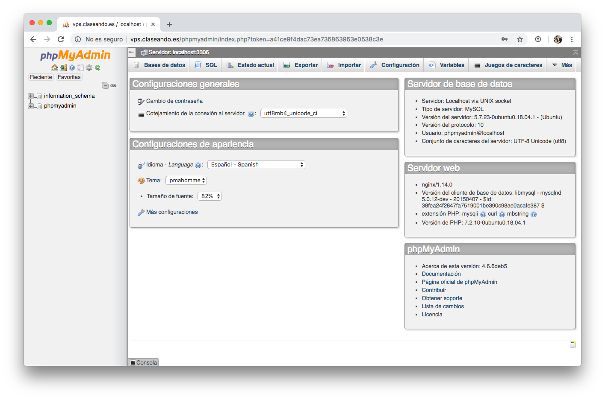

# phpMyAdmin

Si bien es cierto que podemos gestionar nuestras bases de datos **MySQL** desde el intérprete de terminal usando el comando `mysql`, existen otras alternativas con interfaz gráfica de usuario (GUI).

La herramienta más extendida para ello se denomina **phpMyAdmin**. Está implementada en el lenguaje de programación *php* y se accede a través de un servidor web, en nuestro caso **Nginx**, que ya hemos configurado para que procese peticiones *php*.

## Instalación

Para su instalación, usaremos el paquete preparado a tal efecto:

~~~console
sdelquin@claseando:~$ sudo apt install phpmyadmin
Descargados 3.861 kB en 0s (9.037 kB/s)
Preconfigurando paquetes ...
Determining localhost credentials from /etc/mysql/debian.cnf: succeeded.
Seleccionando el paquete phpmyadmin previamente no seleccionado.
(Leyendo la base de datos ... 93353 ficheros o directorios instalados actualmente.)
Preparando para desempaquetar .../phpmyadmin_4%3a4.6.6-5_all.deb ...
Desempaquetando phpmyadmin (4:4.6.6-5) ...
Configurando phpmyadmin (4:4.6.6-5) ...
Determining localhost credentials from /etc/mysql/debian.cnf: succeeded.
dbconfig-common: writing config to /etc/dbconfig-common/phpmyadmin.conf
~~~

El programa de instalación nos abrirá varios diálogos para configurar nuestro *phpMyAdmin*. En primer lugar nos pregunta por el servidor web que vamos a utilizar. Las dos únicas alternativas que ofrece son:
* `apache2`
* `lighthttpd`

Dado que nosotros utilizamos *Nginx*, lo dejamos en blanco y pulsamos en <kbd>Ok</kbd>:

A continuación el programa de instalación debe crear una base de datos para que *phpMyAdmin* pueda trabajar. Pulsamos el botón <kbd>Yes</kbd>

En la siguiente pantalla nos solicita una contraseña con la que registrar la base de datos en *MySQL*. Esto significa que se va a crear un usuario `phpmyadmin` con la contraseña que nosotros especifiquemos para acceder al sistema gestor de bases de datos:

> **OJO:** Aunque nuestra política de seguridad de contraseñas en *MySQL* esté establecida a nivel BAJO, durante la instalación de *phpmyadmin* se sube a nivel MEDIO. Por lo tanto tenemos que cumplir con la directiva de seguridad de contraseñas establecida.

> Otra opción es parar la instalación, bajar el nivel de seguridad de contraseñas a BAJO y volver a configurar el paquete usando el comando: `sudo dpkg-reconfigure phpmyadmin`

Volvemos a repetir la contraseña:

Después de esto, el programa de instalación termina de configurar los paquetes pendientes:

~~~console
Creating config file /etc/dbconfig-common/phpmyadmin.conf with new version

Creating config file /etc/phpmyadmin/config-db.php with new version
checking privileges on database phpmyadmin for phpmyadmin@localhost: user creation needed.
granting access to database phpmyadmin for phpmyadmin@localhost: success.
verifying access for phpmyadmin@localhost: success.
creating database phpmyadmin: success.
verifying database phpmyadmin exists: success.
populating database via sql...  done.
dbconfig-common: flushing administrative password
Procesando disparadores para man-db (2.8.3-2) ...
sdelquin@claseando:~$
~~~

## Activación en Nginx

Pero aún no hemos acabado, ya que debemos configurar nuestro **Nginx** para que pueda servir **phpMyAdmin**.

Vamos a crear un *virtual host* para la url `http://phpmyadmin.imwpto.me` que nos permita trabajar con la plataforma:

~~~console
sdelquin@claseando:~$ sudo vi /etc/nginx/sites-available/vps.claseando.es
...
~~~

~~~nginx
server {
    server_name vps.claseando.es;

    location /blog {
        root /home/sdelquin/webapps;
    }

    # ---> insertar esto
    location /phpmyadmin {
        index index.php;
        root /usr/share;
        location ~ \.php$ {
            include snippets/fastcgi-php.conf;
            fastcgi_pass unix:/run/php/php7.2-fpm.sock;
        }
    }
    # <---
}
~~~

No es necesario enlazar el *virtual-host* porque ya estaba hecho de antes. Ahora sólo nos queda recargar el servidor web:

~~~console
sdelquin@claseando:~$ sudo systemctl reload nginx
sdelquin@claseando:~$
~~~

Con esto, ya podemos acceder a través de un navegador a la dirección en la que hemos configurado nuestro *phpMyAdmin*, poniendo las credenciales que hemos creado anteriormente:

Podemos acceder a la interfaz administrativa de nuestro gestor de bases de datos *MySQL*:

### Cambiando la URL de acceso a phpMyAdmin

Por *razones de seguridad*, podríamos querer que el acceso a *phpMyAdmin* no se haga en la ruta `http://host/phpmyadmin`. Supongamos que queremos cambiar nuestra ruta de acceso para que sea:

    http://vps.claseando.es/db

En primer lugar cambiamos nuestro *location* en el fichero de configuración de *Nginx*:

~~~console
sdelquin@claseando:~$ sudo vi /etc/nginx/sites-available/vps.claseando.es
...
~~~

~~~nginx
server {
    server_name vps.claseando.es;

    location /blog {
        root /home/sdelquin/webapps;
    }

    # ---> cambiar sólo la siguiente línea
    location /bd {
        index index.php;
        root /usr/share;
        location ~ \.php$ {
            include snippets/fastcgi-php.conf;
            fastcgi_pass unix:/run/php/php7.2-fpm.sock;
        }
    }
}
~~~

Ahora creamos un *enlace simbólico* para que apunte al raíz de *phpMyAdmin*:

~~~console
sdelquin@claseando:~$ cd /usr/share/
sdelquin@claseando:/usr/share$ sudo ln -s phpmyadmin bd
sdelquin@claseando:/usr/share$ ls -ld bd
lrwxrwxrwx 1 root root 10 oct 10 19:25 bd -> phpmyadmin
sdelquin@claseando:/usr/share$
~~~

No nos olvidemos de recargar *Nginx*:

~~~console
sdelquin@claseando:~$ sudo systemctl reload nginx
sdelquin@claseando:~$
~~~

Y con esto ya tenemos lista una nueva *url* para acceder a **phpMyAdmin**.
