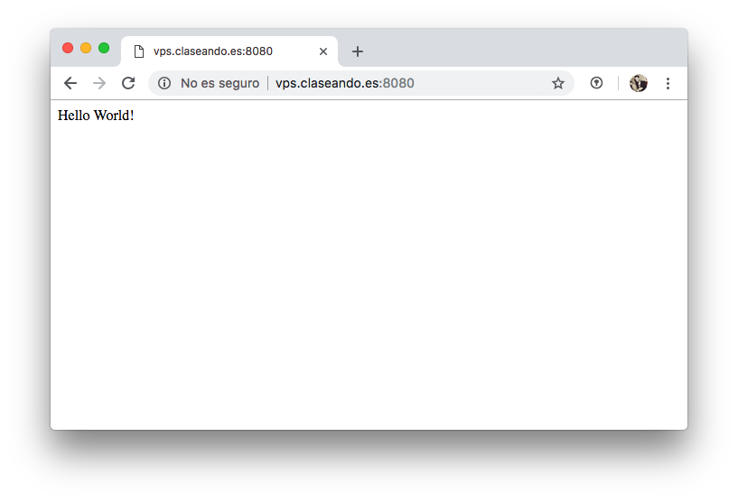
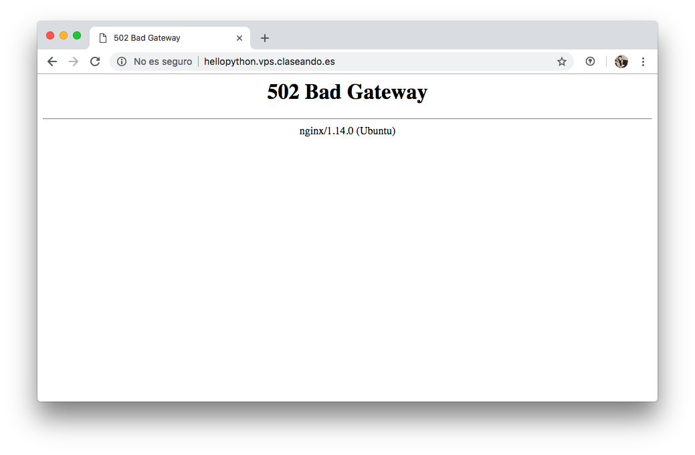
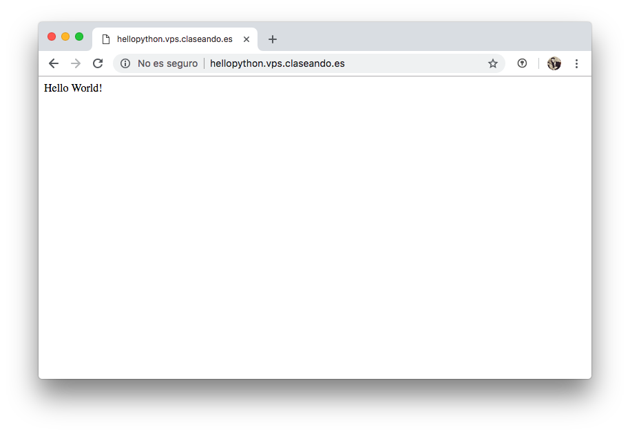

# Configuración de Python

[Instalación](#instalacion)  
[Creación del Hola Mundo](#creación-del-hola-mundo)  
[Configuración del servidor web](#configuración-del-servidor-web)  
[Supervisor](#supervisor)

El objetivo de esta sección es configurar nuestro servidor web para que responda a peticiones que procesen código *Python*.

## Instalación

Lo primero será instalar la última versión de Python disponible para el sistema:

~~~console
sdelquin@claseando:~$ sudo apt install -y python3.7
Leyendo lista de paquetes... Hecho
Des:4 http://mirrors.digitalocean.com/ubuntu bionic-updates/universe amd64 python3.7 amd64 3.7.0-1~18.04 [264 kB]
Descargados 4.245 kB en 1s (5.154 kB/s)
Seleccionando el paquete libpython3.7-minimal:amd64 previamente no seleccionado.
(Leyendo la base de datos ... 95040 ficheros o directorios instalados actualmente.)
Preparando para desempaquetar .../libpython3.7-minimal_3.7.0-1~18.04_amd64.deb ...
Desempaquetando libpython3.7-minimal:amd64 (3.7.0-1~18.04) ...
Seleccionando el paquete python3.7-minimal previamente no seleccionado.
Preparando para desempaquetar .../python3.7-minimal_3.7.0-1~18.04_amd64.deb ...
Desempaquetando python3.7-minimal (3.7.0-1~18.04) ...
Seleccionando el paquete libpython3.7-stdlib:amd64 previamente no seleccionado.
Preparando para desempaquetar .../libpython3.7-stdlib_3.7.0-1~18.04_amd64.deb ...
Desempaquetando libpython3.7-stdlib:amd64 (3.7.0-1~18.04) ...
Seleccionando el paquete python3.7 previamente no seleccionado.
Preparando para desempaquetar .../python3.7_3.7.0-1~18.04_amd64.deb ...
Desempaquetando python3.7 (3.7.0-1~18.04) ...
Procesando disparadores para mime-support (3.60ubuntu1) ...
Configurando libpython3.7-minimal:amd64 (3.7.0-1~18.04) ...
Configurando python3.7-minimal (3.7.0-1~18.04) ...
Procesando disparadores para man-db (2.8.3-2) ...
Configurando libpython3.7-stdlib:amd64 (3.7.0-1~18.04) ...
Configurando python3.7 (3.7.0-1~18.04) ...
sdelquin@claseando:~$
~~~

Vamos ahora a probar que la instalación fue correcta. Ejecutamos lo siguiente:

~~~console
sdelquin@claseando:~$ python3.7
Python 3.7.0 (default, Sep 12 2018, 18:30:08)
[GCC 8.0.1 20180414 (experimental) [trunk revision 259383]] on linux
Type "help", "copyright", "credits" or "license" for more information.
>>> exit()
sdelquin@claseando:~$
~~~

Para no tener que estarnos acordando de la versión a la hora de lanzar el intérprete de Python, podemos añadir un *alias* en el fichero `~/.bashrc`:

~~~console
sdelquin@claseando:~$ echo 'alias python=python3.7' >> .bashrc
sdelquin@claseando:~$ tail -1 .bashrc
alias python=python3.7
sdelquin@claseando:~$ source .bashrc
sdelquin@claseando:~$ python
Python 3.7.0 (default, Sep 12 2018, 18:30:08)
[GCC 8.0.1 20180414 (experimental) [trunk revision 259383]] on linux
Type "help", "copyright", "credits" or "license" for more information.
>>> exit()
sdelquin@claseando:~$
~~~

### Librerías de desarrollo para Python

Los paquetes de *Python* necesitan ciertas librerías para su funcionamiento. Por ello debemos instalar lo siguiente:

~~~console
sdelquin@claseando:~$ sudo apt install -y python3.7-dev python3-distutils
Leyendo lista de paquetes... Hecho
Creando árbol de dependencias
Leyendo la información de estado... Hecho
El paquete indicado a continuación se instaló de forma automática y ya no es necesario.
  grub-pc-bin
Utilice «sudo apt autoremove» para eliminarlo.
Preparando para desempaquetar .../4-libpython3.7_3.7.0-1~18.04_amd64.deb ...
Desempaquetando libpython3.7:amd64 (3.7.0-1~18.04) ...
Seleccionando el paquete libpython3.7-dev:amd64 previamente no seleccionado.
Preparando para desempaquetar .../5-libpython3.7-dev_3.7.0-1~18.04_amd64.deb ...
Desempaquetando libpython3.7-dev:amd64 (3.7.0-1~18.04) ...
Seleccionando el paquete manpages-dev previamente no seleccionado.
Preparando para desempaquetar .../6-manpages-dev_4.15-1_all.deb ...
Desempaquetando manpages-dev (4.15-1) ...
Seleccionando el paquete python3.7-dev previamente no seleccionado.
Preparando para desempaquetar .../7-python3.7-dev_3.7.0-1~18.04_amd64.deb ...
Desempaquetando python3.7-dev (3.7.0-1~18.04) ...
Configurando linux-libc-dev:amd64 (4.15.0-36.39) ...
Procesando disparadores para libc-bin (2.27-3ubuntu1) ...
Configurando libpython3.7:amd64 (3.7.0-1~18.04) ...
Procesando disparadores para man-db (2.8.3-2) ...
Configurando libc-dev-bin (2.27-3ubuntu1) ...
Configurando manpages-dev (4.15-1) ...
Configurando libc6-dev:amd64 (2.27-3ubuntu1) ...
Configurando libexpat1-dev:amd64 (2.2.5-3) ...
Configurando libpython3.7-dev:amd64 (3.7.0-1~18.04) ...
Configurando python3.7-dev (3.7.0-1~18.04) ...
Procesando disparadores para libc-bin (2.27-3ubuntu1) ...
sdelquin@claseando:~$
~~~

Para la compilación de muchos paquetes, también necesitaremos un compilador de *C*:

~~~console
sdelquin@claseando:~$ sudo apt install -y gcc
Leyendo lista de paquetes... Hecho
Creando árbol de dependencias
Leyendo la información de estado... Hecho
El paquete indicado a continuación se instaló de forma automática y ya no es necesario.
  grub-pc-bin
Utilice «sudo apt autoremove» para eliminarlo.
Se instalarán los siguientes paquetes adicionales:
  binutils binutils-common binutils-x86-64-linux-gnu cpp cpp-7 gcc-7 gcc-7-base gcc-8-base libasan4
  libatomic1 libbinutils libcc1-0 libcilkrts5 libgcc-7-dev libgcc1 libgomp1 libisl19 libitm1 liblsan0
  libmpc3 libmpx2 libquadmath0 libstdc++6 libtsan0 libubsan0
Paquetes sugeridos:
  binutils-doc cpp-doc gcc-7-locales gcc-multilib make autoconf automake libtool flex bison gdb gcc-doc
  gcc-7-multilib gcc-7-doc libgcc1-dbg libgomp1-dbg libitm1-dbg libatomic1-dbg libasan4-dbg liblsan0-dbg
  libtsan0-dbg libubsan0-dbg libcilkrts5-dbg libmpx2-dbg libquadmath0-dbg
Se instalarán los siguientes paquetes NUEVOS:
  binutils binutils-common binutils-x86-64-linux-gnu cpp cpp-7 gcc gcc-7 gcc-7-base libasan4 libatomic1
  libbinutils libcc1-0 libcilkrts5 libgcc-7-dev libgomp1 libisl19 libitm1 liblsan0 libmpc3 libmpx2
  libquadmath0 libtsan0 libubsan0
Se actualizarán los siguientes paquetes:
  gcc-8-base libgcc1 libstdc++6
3 actualizados, 23 nuevos se instalarán, 0 para eliminar y 46 no actualizados.
Se necesita descargar 21,5 MB de archivos.
Se utilizarán 85,9 MB de espacio de disco adicional después de esta operación.
Des:1 http://ams2.mirrors.digitalocean.com/ubuntu bionic-updates/main amd64 gcc-8-base amd64 8.2.0-1ubuntu2~18.04 [18,3 kB]
Des:2 http://ams2.mirrors.digitalocean.com/ubuntu bionic-updates/main amd64 libstdc++6 amd64 8.2.0-1ubuntu2~18.04 [398 kB]
Des:3 http://ams2.mirrors.digitalocean.com/ubuntu bionic-updates/main amd64 libgcc1 amd64 1:8.2.0-1ubuntu2~18.04 [40,7 kB]
Des:4 http://ams2.mirrors.digitalocean.com/ubuntu bionic-updates/main amd64 binutils-common amd64 2.30-21ubuntu1~18.04 [193 kB]
Des:5 http://ams2.mirrors.digitalocean.com/ubuntu bionic-updates/main amd64 libbinutils amd64 2.30-21ubuntu1~18.04 [502 kB]
Des:6 http://ams2.mirrors.digitalocean.com/ubuntu bionic-updates/main amd64 binutils-x86-64-linux-gnu amd64 2.30-21ubuntu1~18.04 [1.855 kB]
Des:7 http://ams2.mirrors.digitalocean.com/ubuntu bionic-updates/main amd64 binutils amd64 2.30-21ubuntu1~18.04 [3.392 B]
Des:8 http://ams2.mirrors.digitalocean.com/ubuntu bionic-updates/main amd64 gcc-7-base amd64 7.3.0-27ubuntu1~18.04 [18,9 kB]
Des:9 http://ams2.mirrors.digitalocean.com/ubuntu bionic/main amd64 libisl19 amd64 0.19-1 [551 kB]
Des:10 http://ams2.mirrors.digitalocean.com/ubuntu bionic/main amd64 libmpc3 amd64 1.1.0-1 [40,8 kB]
Des:11 http://ams2.mirrors.digitalocean.com/ubuntu bionic-updates/main amd64 cpp-7 amd64 7.3.0-27ubuntu1~18.04 [6.738 kB]
Des:12 http://ams2.mirrors.digitalocean.com/ubuntu bionic-updates/main amd64 cpp amd64 4:7.3.0-3ubuntu2.1 [27,6 kB]
Des:13 http://ams2.mirrors.digitalocean.com/ubuntu bionic-updates/main amd64 libcc1-0 amd64 8.2.0-1ubuntu2~18.04 [39,5 kB]
Des:14 http://ams2.mirrors.digitalocean.com/ubuntu bionic-updates/main amd64 libgomp1 amd64 8.2.0-1ubuntu2~18.04 [76,4 kB]
Des:15 http://ams2.mirrors.digitalocean.com/ubuntu bionic-updates/main amd64 libitm1 amd64 8.2.0-1ubuntu2~18.04 [28,1 kB]
Configurando libtsan0:amd64 (8.2.0-1ubuntu2~18.04) ...
Configurando liblsan0:amd64 (8.2.0-1ubuntu2~18.04) ...
Configurando gcc-7-base:amd64 (7.3.0-27ubuntu1~18.04) ...
Configurando binutils-common:amd64 (2.30-21ubuntu1~18.04) ...
Configurando libmpx2:amd64 (8.2.0-1ubuntu2~18.04) ...
Procesando disparadores para libc-bin (2.27-3ubuntu1) ...
Procesando disparadores para man-db (2.8.3-2) ...
Configurando libmpc3:amd64 (1.1.0-1) ...
Configurando libitm1:amd64 (8.2.0-1ubuntu2~18.04) ...
Configurando libisl19:amd64 (0.19-1) ...
Configurando libasan4:amd64 (7.3.0-27ubuntu1~18.04) ...
Configurando libbinutils:amd64 (2.30-21ubuntu1~18.04) ...
Configurando libcilkrts5:amd64 (7.3.0-27ubuntu1~18.04) ...
Configurando libubsan0:amd64 (7.3.0-27ubuntu1~18.04) ...
Configurando libgcc-7-dev:amd64 (7.3.0-27ubuntu1~18.04) ...
Configurando cpp-7 (7.3.0-27ubuntu1~18.04) ...
Configurando binutils-x86-64-linux-gnu (2.30-21ubuntu1~18.04) ...
Configurando cpp (4:7.3.0-3ubuntu2.1) ...
Configurando binutils (2.30-21ubuntu1~18.04) ...
Configurando gcc-7 (7.3.0-27ubuntu1~18.04) ...
Configurando gcc (4:7.3.0-3ubuntu2.1) ...
Procesando disparadores para libc-bin (2.27-3ubuntu1) ...
sdelquin@claseando:~$
~~~

Comprobamos la instalación del compilador `gcc`:

~~~console
sdelquin@claseando:~$ gcc --version
gcc (Ubuntu 7.3.0-27ubuntu1~18.04) 7.3.0
Copyright (C) 2017 Free Software Foundation, Inc.
This is free software; see the source for copying conditions.  There is NO
warranty; not even for MERCHANTABILITY or FITNESS FOR A PARTICULAR PURPOSE.

sdelquin@claseando:~$
~~~

### Gestión de paquetes

Existe una herramienta que permite instalar paquetes *python*. Se llama `pip`. Para su instalación hacemos lo siguiente:

~~~console
sdelquin@claseando:~$ mkdir tmp
sdelquin@claseando:~$ cd tmp
sdelquin@claseando:~/tmp$ curl https://bootstrap.pypa.io/get-pip.py -o get-pip.py
  % Total    % Received % Xferd  Average Speed   Time    Time     Time  Current
                                 Dload  Upload   Total   Spent    Left  Speed
100 1622k  100 1622k    0     0  6338k      0 --:--:-- --:--:-- --:--:-- 6314k
sdelquin@claseando:~/tmp$ sudo -H python3.7 get-pip.py
Collecting pip
  Downloading https://files.pythonhosted.org/packages/c2/d7/90f34cb0d83a6c5631cf71dfe64cc1054598c843a92b400e55675cc2ac37/pip-18.1-py2.py3-none-any.whl (1.3MB)
    100% |████████████████████████████████| 1.3MB 8.9MB/s
Installing collected packages: pip
  Found existing installation: pip 18.1
    Uninstalling pip-18.1:
      Successfully uninstalled pip-18.1
Successfully installed pip-18.1
sdelquin@claseando:~/tmp$
~~~

Comprobamos la instalación de `pip` lanzando el siguiente comando:

~~~console
sdelquin@claseando:~$ pip --version
pip 18.1 from /usr/local/lib/python3.7/dist-packages/pip (python 3.7)
sdelquin@claseando:~$
~~~

### Entornos virtuales

La forma más extendida de trabajar con aplicaciones *Python* es usar entornos virtuales (*virtualenvs*). Se trata de un mecanismo para aislar las librerías y crear un ambiente de trabajo independiente.

Antes de nada vamos a añadir a nuestro `PATH` la carpeta `~/.local/bin` porque ahí se van a instalar ciertos ficheros ejecutables (para los entornos virtuales):

~~~console
sdelquin@claseando:~$ vi .bashrc
...
~~~

> Añadir al final del fichero:

~~~bash
export PATH=$PATH:~/.local/bin
~~~

Recargamos el fichero de configuración:

~~~console
sdelquin@claseando:~$ source .bashrc
sdelquin@claseando:~$
~~~

La herramienta más moderna que permite trabajar con entornos virtuales es `pipenv`. Vamos a realizar su instalación:

~~~console
sdelquin@claseando:~$ sudo -H pip install pipenv
Collecting pipenv
  Downloading https://files.pythonhosted.org/packages/7a/44/36bc7dc1c15b17419e36dd8e9c0b4b42fd5761071c7a171d7351c4ad49bd/pipenv-2018.10.9-py3-none-any.whl (5.1MB)
    100% |████████████████████████████████| 5.1MB 5.2MB/s
Requirement already satisfied: setuptools>=36.2.1 in /usr/lib/python3/dist-packages (from pipenv) (39.0.1)
Requirement already satisfied: pip>=9.0.1 in /usr/local/lib/python3.7/dist-packages (from pipenv) (18.1)
Collecting virtualenv-clone>=0.2.5 (from pipenv)
  Downloading https://files.pythonhosted.org/packages/6d/c2/dccb5ccf599e0c5d1eea6acbd058af7a71384f9740179db67a9182a24798/virtualenv_clone-0.3.0-py2.py3-none-any.whl
Collecting virtualenv (from pipenv)
  Downloading https://files.pythonhosted.org/packages/b6/30/96a02b2287098b23b875bc8c2f58071c35d2efe84f747b64d523721dc2b5/virtualenv-16.0.0-py2.py3-none-any.whl (1.9MB)
    100% |████████████████████████████████| 1.9MB 10.1MB/s
Requirement already satisfied: certifi in /usr/lib/python3/dist-packages (from pipenv) (2018.1.18)
Installing collected packages: virtualenv-clone, virtualenv, pipenv
Successfully installed pipenv-2018.10.9 virtualenv-16.0.0 virtualenv-clone-0.3.0
sdelquin@claseando:~$
~~~

#### Primer entorno virtual

Creamos la carpeta que va a contener el entorno virtual:

~~~console
sdelquin@claseando:~$ mkdir -p webapps/hellopython
sdelquin@claseando:~$ cd webapps/hellopython
sdelquin@claseando:~/webapps/hellopython$
~~~

A continuación creamos nuestro primer entorno virtual:

~~~console
sdelquin@claseando:~/webapps/hellopython$ pipenv install
Creating a virtualenv for this project…
Pipfile: /home/sdelquin/webapps/hellopython/Pipfile
Using /usr/bin/python3.7 (3.7.0) to create virtualenv…
⠹Already using interpreter /usr/bin/python3.7
Using base prefix '/usr'
/home/sdelquin/.local/lib/python3.7/site-packages/virtualenv.py:1041: DeprecationWarning: the imp module is deprecated in favour of importlib; see the module's documentation for alternative uses
  import imp
New python executable in /home/sdelquin/.local/share/virtualenvs/hellopython-j3yclt1I/bin/python3.7
Also creating executable in /home/sdelquin/.local/share/virtualenvs/hellopython-j3yclt1I/bin/python
Installing setuptools, pip, wheel...done.

Virtualenv location: /home/sdelquin/.local/share/virtualenvs/hellopython-j3yclt1I
Creating a Pipfile for this project…
Pipfile.lock not found, creating…
Locking [dev-packages] dependencies…
Locking [packages] dependencies…
Updated Pipfile.lock (a65489)!
Installing dependencies from Pipfile.lock (a65489)…
  🐍   ▉▉▉▉▉▉▉▉▉▉▉▉▉▉▉▉▉▉▉▉▉▉▉▉▉▉▉▉▉▉▉▉ 0/0 — 00:00:00
To activate this project's virtualenv, run pipenv shell.
Alternatively, run a command inside the virtualenv with pipenv run.
sdelquin@claseando:~/webapps/hellopython$
~~~

Si miramos en la carpeta, vemos que se han creado dos ficheros `Pipfile` de dependencias:

~~~console
sdelquin@claseando:~/webapps/hellopython$ ls
Pipfile  Pipfile.lock
sdelquin@claseando:~/webapps/hellopython$
~~~

¿Pero dónde está realmente el entorno virtual con todas las librerías?

~~~console
sdelquin@claseando:~/webapps/hellopython$ pipenv --venv
/home/sdelquin/.local/share/virtualenvs/hellopython-j3yclt1I
sdelquin@claseando:~/webapps/hellopython$ tree -dL 3 /home/sdelquin/.local/share/virtualenvs/hellopython-j3yclt1I
/home/sdelquin/.local/share/virtualenvs/hellopython-j3yclt1I
├── bin
├── include
│   └── python3.7m -> /usr/include/python3.7m
├── lib
│   └── python3.7
│       ├── collections -> /usr/lib/python3.7/collections
│       ├── config-3.7m-x86_64-linux-gnu -> /usr/lib/python3.7/config-3.7m-x86_64-linux-gnu
│       ├── distutils
│       ├── encodings -> /usr/lib/python3.7/encodings
│       ├── importlib -> /usr/lib/python3.7/importlib
│       ├── lib-dynload -> /usr/lib/python3.7/lib-dynload
│       └── site-packages
└── src

13 directories
sdelquin@claseando:~/webapps/hellopython$
~~~

### uWSGI

*uWSGI* es el encargado de procesar las peticiones *http* para aplicaciones con código *python*. Se puede ver como el *php-fpm* de *php*.

Dado que vamos a utilizarlo en todos nuestros sitios web Python, lo vamos a instalar de manera global:

~~~console
sdelquin@claseando:~$ sudo -H pip install uwsgi
[sudo] password for sdelquin:
Collecting uwsgi
  Downloading https://files.pythonhosted.org/packages/a2/c9/a2d5737f63cd9df4317a4acc15d1ddf4952e28398601d8d7d706c16381e0/uwsgi-2.0.17.1.tar.gz (800kB)
    100% |████████████████████████████████| 808kB 9.2MB/s
Building wheels for collected packages: uwsgi
  Running setup.py bdist_wheel for uwsgi ... done
  Stored in directory: /root/.cache/pip/wheels/32/d6/90/0239cc69219013d9f402b098b7c5ef7454792c21acd1d6c24e
Successfully built uwsgi
Installing collected packages: uwsgi
Successfully installed uwsgi-2.0.17.1
sdelquin@claseando:~$
~~~

## Creación del "Hola Mundo"

Lo primero será instalar un mini-framework de desarrollo web denominado `flask`:

~~~console
sdelquin@claseando:~/webapps/hellopython$ pipenv install flask
Installing flask…
Collecting flask
  Downloading https://files.pythonhosted.org/packages/7f/e7/08578774ed4536d3242b14dacb4696386634607af824ea997202cd0edb4b/Flask-1.0.2-py2.py3-none-any.whl (91kB)
Collecting Jinja2>=2.10 (from flask)
  Downloading https://files.pythonhosted.org/packages/7f/ff/ae64bacdfc95f27a016a7bed8e8686763ba4d277a78ca76f32659220a731/Jinja2-2.10-py2.py3-none-any.whl (126kB)
Collecting itsdangerous>=0.24 (from flask)
  Downloading https://files.pythonhosted.org/packages/dc/b4/a60bcdba945c00f6d608d8975131ab3f25b22f2bcfe1dab221165194b2d4/itsdangerous-0.24.tar.gz (46kB)
Collecting Werkzeug>=0.14 (from flask)
  Downloading https://files.pythonhosted.org/packages/20/c4/12e3e56473e52375aa29c4764e70d1b8f3efa6682bef8d0aae04fe335243/Werkzeug-0.14.1-py2.py3-none-any.whl (322kB)
Collecting click>=5.1 (from flask)
  Downloading https://files.pythonhosted.org/packages/fa/37/45185cb5abbc30d7257104c434fe0b07e5a195a6847506c074527aa599ec/Click-7.0-py2.py3-none-any.whl (81kB)
Collecting MarkupSafe>=0.23 (from Jinja2>=2.10->flask)
  Downloading https://files.pythonhosted.org/packages/4d/de/32d741db316d8fdb7680822dd37001ef7a448255de9699ab4bfcbdf4172b/MarkupSafe-1.0.tar.gz
Building wheels for collected packages: itsdangerous, MarkupSafe
  Running setup.py bdist_wheel for itsdangerous: started
  Running setup.py bdist_wheel for itsdangerous: finished with status 'done'
  Stored in directory: /home/sdelquin/.cache/pipenv/wheels/2c/4a/61/5599631c1554768c6290b08c02c72d7317910374ca602ff1e5
  Running setup.py bdist_wheel for MarkupSafe: started
  Running setup.py bdist_wheel for MarkupSafe: finished with status 'done'
  Stored in directory: /home/sdelquin/.cache/pipenv/wheels/33/56/20/ebe49a5c612fffe1c5a632146b16596f9e64676768661e4e46
Successfully built itsdangerous MarkupSafe
Installing collected packages: MarkupSafe, Jinja2, itsdangerous, Werkzeug, click, flask
Successfully installed Jinja2-2.10 MarkupSafe-1.0 Werkzeug-0.14.1 click-7.0 flask-1.0.2 itsdangerous-0.24

Adding flask to Pipfile's [packages]…
Pipfile.lock (662286) out of date, updating to (a65489)…
Locking [dev-packages] dependencies…
Locking [packages] dependencies…
Updated Pipfile.lock (662286)!
Installing dependencies from Pipfile.lock (662286)…
  🐍   ▉▉▉▉▉▉▉▉▉▉▉▉▉▉▉▉▉▉▉▉▉▉▉▉▉▉▉▉▉▉▉▉ 6/6 — 00:00:05
To activate this project's virtualenv, run pipenv shell.
Alternatively, run a command inside the virtualenv with pipenv run.
sdelquin@claseando:~/webapps/hellopython$
~~~

A continuación creamos un pequeño fichero en *Python* que va a contener el código de la aplicación web:

~~~console
sdelquin@claseando:~/webapps/hellopython$ vi main.py
...
~~~

~~~python
from flask import Flask
app = Flask(__name__)

@app.route("/")
def hello():
    return "Hello World!"
~~~

En este punto podemos lanzar el proceso que escuchará peticiones:

~~~console
sdelquin@claseando:~/webapps/hellopython$ uwsgi --socket :8080 --protocol http --home $(pipenv --venv) -w main:app
*** Starting uWSGI 2.0.17.1 (64bit) on [Tue Oct  9 18:35:49 2018] ***
compiled with version: 7.3.0 on 09 October 2018 18:20:35
os: Linux-4.15.0-34-generic #37-Ubuntu SMP Mon Aug 27 15:21:48 UTC 2018
nodename: claseando
machine: x86_64
clock source: unix
detected number of CPU cores: 1
current working directory: /home/sdelquin/webapps/hellopython
detected binary path: /usr/local/bin/uwsgi
!!! no internal routing support, rebuild with pcre support !!!
*** WARNING: you are running uWSGI without its master process manager ***
your processes number limit is 3841
your memory page size is 4096 bytes
detected max file descriptor number: 1024
lock engine: pthread robust mutexes
thunder lock: disabled (you can enable it with --thunder-lock)
uwsgi socket 0 bound to TCP address :8080 fd 3
Python version: 3.7.0 (default, Sep 12 2018, 18:30:08)  [GCC 8.0.1 20180414 (experimental) [trunk revision 259383]]
Set PythonHome to /home/sdelquin/.local/share/virtualenvs/hellopython-j3yclt1I
*** Python threads support is disabled. You can enable it with --enable-threads ***
Python main interpreter initialized at 0x5613675e6020
your server socket listen backlog is limited to 100 connections
your mercy for graceful operations on workers is 60 seconds
mapped 72904 bytes (71 KB) for 1 cores
*** Operational MODE: single process ***
WSGI app 0 (mountpoint='') ready in 0 seconds on interpreter 0x5613675e6020 pid: 26417 (default app)
*** uWSGI is running in multiple interpreter mode ***
spawned uWSGI worker 1 (and the only) (pid: 26417, cores: 1)
~~~

Vamos a analizar cada uno de los parámetros utilizados:

- `--socket :8080`: estamos utilizando el puerto 8080.
- `--protocol=http`: estamos utilizando protocolo *http*.
- `--home $(pipenv --venv)`: estamos especificando a dónde debe ir a buscar el intérprete de Python para este entorno virtual.
- `-w main:app`: estamos indicando que dentro del fichero `main.py` debe ejecutar la aplicación Flask denominada `app`.

Si ahora accedemos con un navegador al puerto 8080 de nuestra máquina de producción, veremos lo siguiente:

> Para detener el proceso `uwsgi` basta con <kbd>CONTROL-C</kbd>.

## Configuración del servidor web

En primer lugar creamos un script que sintetize el largo comando utilizando anteriormente:

~~~console
sdelquin@claseando:~/webapps/hellopython$ vi run.sh
...
~~~

~~~console
#!/bin/bash

cd "$(dirname "$0")"
PYTHON_VENV=$(pipenv --venv)
uwsgi --socket :8080 --home $PYTHON_VENV -w main:app
~~~

> **OJO**: Hemos eliminado el flag `--protocol http` porque cuando usamos `uwsgi` junto a `Nginx` no tenemos que hablar directamente `http`.

Ahora le damos permisos de ejecución al script que hemos creado:

~~~console
sdelquin@claseando:~/webapps/hellopython$ chmod +x run.sh
sdelquin@claseando:~/webapps/hellopython$ ls -l run.sh
-rwxrwxr-x 1 sdelquin sdelquin 132 oct  9 18:42 run.sh
sdelquin@claseando:~/webapps/hellopython$
~~~

En este punto, podríamos lanzar el script `run.sh` sin tener que activar el entorno virtual previamente, ya que el propio script realiza esta tarea:

~~~console
sdelquin@claseando:~/webapps/hellopython$ ./run.sh
*** Starting uWSGI 2.0.17.1 (64bit) on [Tue Oct  9 18:43:05 2018] ***
compiled with version: 7.3.0 on 09 October 2018 18:20:35
os: Linux-4.15.0-34-generic #37-Ubuntu SMP Mon Aug 27 15:21:48 UTC 2018
nodename: claseando
machine: x86_64
clock source: unix
detected number of CPU cores: 1
current working directory: /home/sdelquin/webapps/hellopython
detected binary path: /usr/local/bin/uwsgi
...
~~~

> Para detener el script `run.sh` basta con <kbd>CONTROL-C</kbd>.

### `Nginx`

Vamos a crear un *virtual host* para nuestra aplicación *Python*. Queremos que responda a peticiones a la url `http://hellopython.vps.claseando.es`. Para ello haremos lo siguiente:

~~~console
sdelquin@claseando:~$ sudo vi /etc/nginx/sites-available/hellopython.vps.claseando.es
...
~~~

~~~nginx
server {
    server_name hellopython.vps.claseando.es;

    location / {
        uwsgi_pass 127.0.0.1:8080;   # puerto al que reenviamos las peticiones
        include uwsgi_params;
    }
    
    location /static {
        root /home/sdelquin/webapps/hellopython;  # para servir ficheros estáticos
    }
}
~~~

Enlazamos el *virtual host* para habilitarlo:

~~~console
sdelquin@claseando:~$ cd /etc/nginx/sites-enabled/
sdelquin@claseando:/etc/nginx/sites-enabled$ sudo ln -s ../sites-available/hellopython.vps.claseando.es
sdelquin@claseando:/etc/nginx/sites-enabled$ ls -l
total 0
lrwxrwxrwx 1 root root 47 oct  9 18:48 hellopython.vps.claseando.es -> ../sites-available/hellopython.vps.claseando.es
lrwxrwxrwx 1 root root 41 sep 16 15:32 hello.vps.claseando.es -> ../sites-available/hello.vps.claseando.es
lrwxrwxrwx 1 root root 41 sep 16 15:50 share.vps.claseando.es -> ../sites-available/share.vps.claseando.es
lrwxrwxrwx 1 root root 35 sep 16 15:35 vps.claseando.es -> ../sites-available/vps.claseando.es
sdelquin@claseando:/etc/nginx/sites-enabled$
~~~

Ahora recargamos el servidor web:

~~~console
sdelquin@claseando:~$ sudo systemctl reload nginx
sdelquin@claseando:~$
~~~

En este momento, las peticiones que lleguen a nuestro servidor *Nginx* en la url definida serán derivados a un servicio que debería estar escuchando en nuestra máquina en el puerto 8080. Si probamos a acceder en este momento a nuestro servidor web, nos aparece lo siguiente:

Se debe a que nos falta lanzar nuestra aplicación *uWSGI* para que escuche en el socket especificado y devuelva el sencillo *html* que hemos preparado en nuestra aplicación *python*:

~~~console
sdelquin@claseando:~$ webapps/hellopython/run.sh
*** Starting uWSGI 2.0.17.1 (64bit) on [Tue Oct  9 18:52:32 2018] ***
compiled with version: 7.3.0 on 09 October 2018 18:20:35
os: Linux-4.15.0-34-generic #37-Ubuntu SMP Mon Aug 27 15:21:48 UTC 2018
nodename: claseando
machine: x86_64
clock source: unix
detected number of CPU cores: 1
current working directory: /home/sdelquin/webapps/hellopython
detected binary path: /usr/local/bin/uwsgi
...
~~~

Sin parar de ejecutar el comando anterior, volvemos a probar el acceso a través del navegador, y obtenemos lo siguiente:

> Para detener el proceso `uwsgi` basta con <kbd>CONTROL-C</kbd>.

## Supervisor

Para mantener nuestra aplicación "viva" y poder gestionar su arranque/parada de manera sencilla, necesitamos un proceso coordinador. Para este cometido se ha desarrollado [supervisor](http://supervisord.org/).

### Instalación

~~~console
sdelquin@claseando:~$ sudo apt install -y supervisor
Leyendo lista de paquetes... Hecho
Creando árbol de dependencias
Leyendo la información de estado... Hecho
Los paquetes indicados a continuación se instalaron de forma automática y ya no son necesarios.
  dh-python grub-pc-bin libpython3-dev libpython3.6-dev python-pip-whl python3-dev python3-keyring
  python3-keyrings.alt python3-secretstorage python3-wheel python3-xdg python3.6-dev
Utilice «sudo apt autoremove» para eliminarlos.
Se instalarán los siguientes paquetes adicionales:
  libpython-stdlib libpython2.7-minimal libpython2.7-stdlib python python-meld3 python-minimal
  python-pkg-resources python2.7 python2.7-minimal
Paquetes sugeridos:
Desempaquetando python-pkg-resources (39.0.1-2) ...
Seleccionando el paquete python-meld3 previamente no seleccionado.
Preparando para desempaquetar .../python-meld3_1.0.2-2_all.deb ...
Desempaquetando python-meld3 (1.0.2-2) ...
Seleccionando el paquete supervisor previamente no seleccionado.
Preparando para desempaquetar .../supervisor_3.3.1-1.1_all.deb ...
Desempaquetando supervisor (3.3.1-1.1) ...
Procesando disparadores para mime-support (3.60ubuntu1) ...
Procesando disparadores para ureadahead (0.100.0-20) ...
Procesando disparadores para systemd (237-3ubuntu10.3) ...
Procesando disparadores para man-db (2.8.3-2) ...
Configurando libpython2.7-stdlib:amd64 (2.7.15~rc1-1) ...
Configurando python2.7 (2.7.15~rc1-1) ...
Configurando libpython-stdlib:amd64 (2.7.15~rc1-1) ...
Configurando python (2.7.15~rc1-1) ...
Configurando python-meld3 (1.0.2-2) ...
Configurando python-pkg-resources (39.0.1-2) ...
Configurando supervisor (3.3.1-1.1) ...
Created symlink /etc/systemd/system/multi-user.target.wants/supervisor.service → /lib/systemd/system/supervisor.service.
Procesando disparadores para ureadahead (0.100.0-20) ...
Procesando disparadores para systemd (237-3ubuntu10.3) ...
sdelquin@claseando:~$
~~~

Comprobamos que el servicio está correctamente instalado y funcionando:

~~~console
sdelquin@claseando:~$ sudo systemctl status supervisor
● supervisor.service - Supervisor process control system for UNIX
   Loaded: loaded (/lib/systemd/system/supervisor.service; enabled; vendor preset: enabled)
   Active: active (running) since Tue 2018-10-09 19:05:41 UTC; 31s ago
     Docs: http://supervisord.org
 Main PID: 27787 (supervisord)
    Tasks: 1 (limit: 1152)
   CGroup: /system.slice/supervisor.service
           └─27787 /usr/bin/python /usr/bin/supervisord -n -c /etc/supervisor/supervisord.conf

oct 09 19:05:41 claseando systemd[1]: Started Supervisor process control system for UNIX.
oct 09 19:05:41 claseando supervisord[27787]: 2018-10-09 19:05:41,853 CRIT Supervisor running as root (no user
oct 09 19:05:41 claseando supervisord[27787]: 2018-10-09 19:05:41,859 WARN No file matches via include "/etc/s
oct 09 19:05:41 claseando supervisord[27787]: 2018-10-09 19:05:41,894 INFO RPC interface 'supervisor' initiali
oct 09 19:05:41 claseando supervisord[27787]: 2018-10-09 19:05:41,894 CRIT Server 'unix_http_server' running w
oct 09 19:05:41 claseando supervisord[27787]: 2018-10-09 19:05:41,894 INFO supervisord started with pid 27787
lines 1-15/15 (END)
~~~

## Configuración

Para que nuestro programa `hellopython` sea gestionado por *supervisor*, debemos añadir un fichero de configuración:

~~~console
sdelquin@claseando:~$ sudo vi /etc/supervisor/conf.d/hellopython.conf
...
~~~

~~~ini
[program:hellopython]
user = sdelquin
command = /home/sdelquin/webapps/hellopython/run.sh
autostart = true
autorestart = true
stopsignal = INT
killasgroup = true
stderr_logfile = /home/sdelquin/webapps/hellopython/hellopython.err.log
stdout_logfile = /home/sdelquin/webapps/hellopython/hellopython.out.log
~~~

### Permitir la gestión de procesos por usuarios no privilegiados

Nos puede interesar que los usuarios no privilegiados controlen sus propios procesos. Para controlar el arranque/parada/consulta de los procesos, existe una herramienta de *supervisor* llamada `supervisorctl`. Si un usuario no privilegiado intenta ejecutarla, pasa lo siguiente:

~~~console
sdelquin@claseando:~$ supervisorctl status
error: <class 'socket.error'>, [Errno 13] Permission denied: file: /usr/lib/python2.7/socket.py line: 228
sdelquin@claseando:~$
~~~

Esto es así porque el *socket* que usa *supervisord* para funcionar no permite su lectura a usuarios no privilegiados. Para solucionar esto debemos seguir varios pasos. La idea es crear un grupo `supervisor` en el que incluiremos a todos aquellos "desarrolladores":

~~~console
sdelquin@claseando:~$ sudo groupadd supervisor
sdelquin@claseando:~$
~~~

Ahora debemos modificar la configuración inicial de *supervisor*. Hacemos lo siguiente:

~~~console
sdelquin@claseando:~$ sudo vi /etc/supervisor/supervisord.conf
~~~

> Cambiar (y añadir) lo siguiente a partir de la línea 5:
~~~nginx
...
chmod=0770               ; socket file mode (default 0700)
chown=root:supervisor    ; grupo 'supervisor' para usuarios no privilegiados
...
~~~

> **OJO**: Las líneas deben acabar con `;`. Tiene que haber al menos un espacio antes del punto y coma.

Reiniciamos el servicios para que surtan efectos los cambios realizados:

~~~console
sdelquin@claseando:~$ sudo systemctl restart supervisor
sdelquin@claseando:~$
~~~

Comprobamos que el servicio está funcionando con normalidad:

~~~console
sdelquin@claseando:~$ sudo systemctl status supervisor
● supervisor.service - Supervisor process control system for UNIX
   Loaded: loaded (/lib/systemd/system/supervisor.service; enabled; vendor preset: enabled)
   Active: active (running) since Tue 2018-10-09 19:11:13 UTC; 16s ago
     Docs: http://supervisord.org
  Process: 28119 ExecStop=/usr/bin/supervisorctl $OPTIONS shutdown (code=exited, status=0/SUCCESS)
 Main PID: 28120 (supervisord)
    Tasks: 1 (limit: 1152)
   CGroup: /system.slice/supervisor.service
           └─28120 /usr/bin/python /usr/bin/supervisord -n -c /etc/supervisor/supervisord.conf
~~~

> En el caso de que hubieran errores debemos mirar en los ficheros `/var/log/supervisor/supervisord.log` y `/var/log/syslog`.

A continuación tenemos que añadir al usuario de la aplicación (`sdelquin`) al grupo que hemos creado para supervisord (`supervisor`):

~~~console
sdelquin@claseando:~$ sudo usermod -a -G supervisor sdelquin
sdelquin@claseando:~$
~~~

> Para que el cambio de grupo sea efectivo, **HABRÁ QUE SALIR Y VOLVER A ENTRAR EN LA SESIÓN**.

Ahora, desde la *máquina de producción*, pero con un usuario no privilegiado, vemos que ya podemos hacer uso de la gestión de nuestros procesos:

~~~console
sdelquin@claseando:~$ supervisorctl status
hellopython                      RUNNING   pid 28710, uptime 0:00:11
sdelquin@claseando:~$
~~~

En este punto, podemos comprobar que el acceso a la aplicación está funcionando:

## Control de la aplicación

~~~console
sdelquin@claseando:~$ supervisorctl status
hellopython                      RUNNING   pid 28710, uptime 0:00:44
sdelquin@claseando:~$ supervisorctl stop hellopython
hellopython: stopped
sdelquin@claseando:~$ supervisorctl status
hellopython                      STOPPED   Oct 09 07:20 PM
sdelquin@claseando:~$ supervisorctl start hellopython
hellopython: started
sdelquin@claseando:~$ supervisorctl restart hellopython
hellopython: stopped
hellopython: started
sdelquin@claseando:~$ supervisorctl status
hellopython                      RUNNING   pid 28793, uptime 0:00:04
sdelquin@claseando:~$
~~~

Si accedemos al servidor y a la ruta especificada, tendremos disponible nuestra aplicación.

> NOTA: En el caso de que se añadan nuevos procesos que controlar con `supervisor`, tendremos que reiniciar el servicio, tras añadir la nueva configuración `/etc/supervisor/conf.d/<proceso>.conf`. Para ello necesitaremos permisos de superusuario.

> `$ systemctl restart supervisor`
