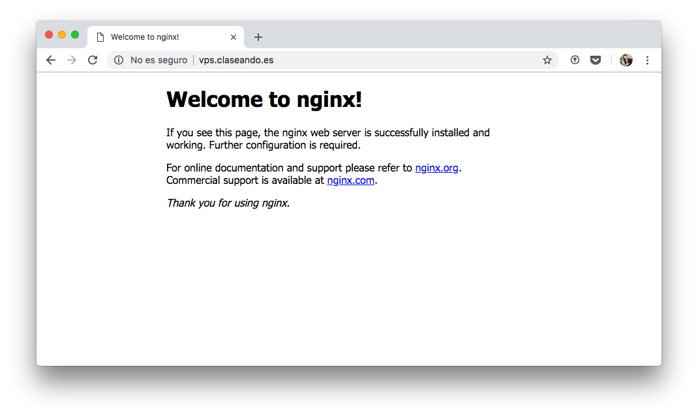
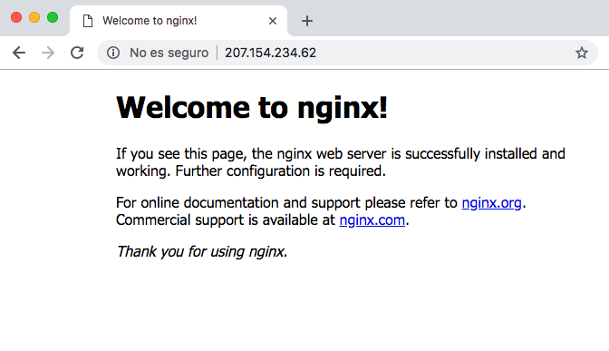
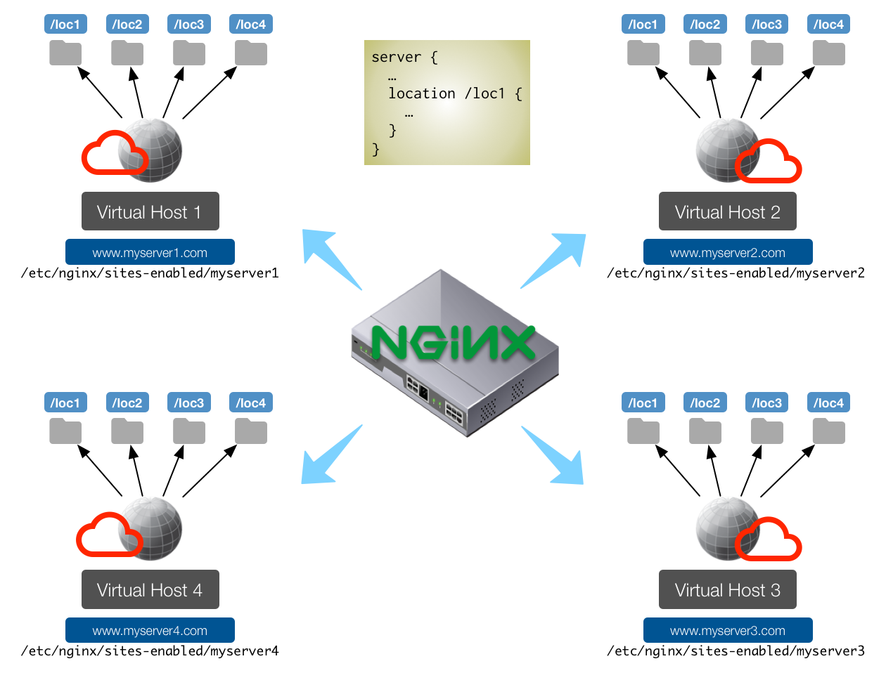
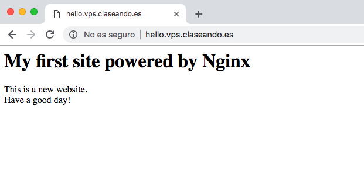
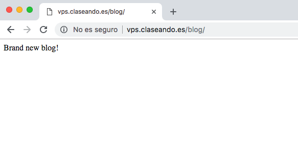
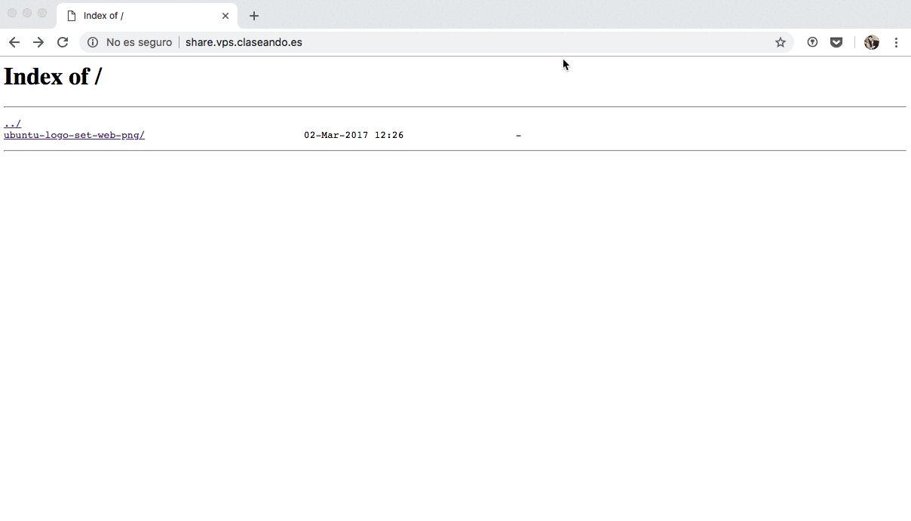
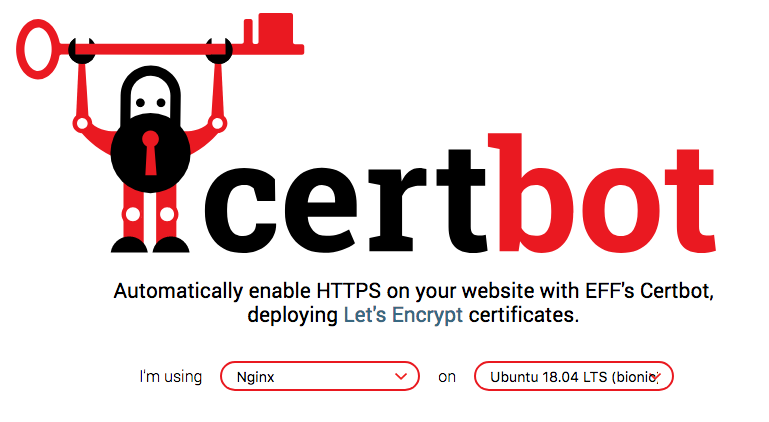
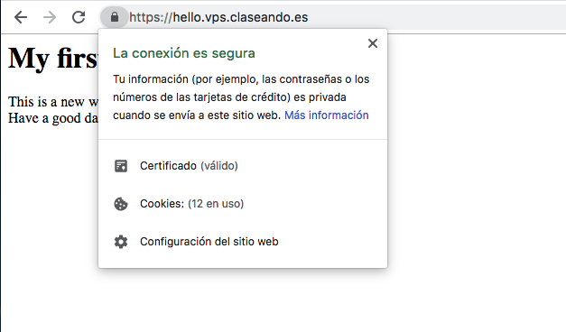
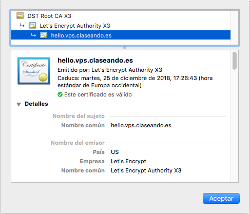

# Servidor Web

[Instalando Nginx](#instalando-nginx)  
[Server y Location](#server-y-location)  
[Listado de directorios](#listado-de-directorios)  
[Acceso restringido con clave](#acceso-restringido-con-clave)  
[Ficheros de log](#ficheros-de-log)  
[Configurando SSL](#configurando-ssl)  
[Redirecciones](#redirecciones)  
[Variables](#variables)

## Instalando Nginx

El servidor con el que vamos a trabajar será **Nginx**.

 

La instalación del servidor **Nginx** es muy sencilla. Lo único que debemos hacer es utilizar el paquete preparado al efecto.

Lo primero es actualizar la lista de paquetes:

~~~console
sdelquin@claseando:~$ sudo apt update
[sudo] password for sdelquin:
Des:1 http://security.ubuntu.com/ubuntu bionic-security InRelease [83,2 kB]
Obj:2 http://ams2.mirrors.digitalocean.com/ubuntu bionic InRelease
Des:5 http://ams2.mirrors.digitalocean.com/ubuntu bionic/main Translation-es [364 kB]
Des:3 http://ams2.mirrors.digitalocean.com/ubuntu bionic-updates InRelease [88,7 kB]
Des:4 http://ams2.mirrors.digitalocean.com/ubuntu bionic-backports InRelease [74,6 kB]
Des:6 http://ams2.mirrors.digitalocean.com/ubuntu bionic/restricted Translation-es [1.960 B]
Des:7 http://ams2.mirrors.digitalocean.com/ubuntu bionic/universe Translation-es [1.259 kB]
Des:8 http://ams2.mirrors.digitalocean.com/ubuntu bionic/multiverse Translation-es [74,9 kB]
Descargados 1.946 kB en 1s (1.360 kB/s)
Leyendo lista de paquetes... Hecho
Creando árbol de dependencias
Leyendo la información de estado... Hecho
Se pueden actualizar 27 paquetes. Ejecute «apt list --upgradable» para verlos.
sdelquin@claseando:~$
~~~

A continuación instalaremos el paquete `nginx`:

~~~console
sdelquin@claseando:~$ sudo apt -y install nginx
Leyendo lista de paquetes... Hecho
Creando árbol de dependencias
Leyendo la información de estado... Hecho
El paquete indicado a continuación se instaló de forma automática y ya no es necesario.
  grub-pc-bin
Utilice «sudo apt autoremove» para eliminarlo.
Se instalarán los siguientes paquetes adicionales:
  fontconfig-config fonts-dejavu-core libfontconfig1 libgd3 libjbig0 libjpeg-turbo8 libjpeg8
  libnginx-mod-http-geoip libnginx-mod-http-image-filter libnginx-mod-http-xslt-filter libnginx-mod-mail
  libnginx-mod-stream libtiff5 libwebp6 libxpm4 nginx-common nginx-core
Paquetes sugeridos:
  libgd-tools fcgiwrap nginx-doc ssl-cert
Se instalarán los siguientes paquetes NUEVOS:
  fontconfig-config fonts-dejavu-core libfontconfig1 libgd3 libjbig0 libjpeg-turbo8 libjpeg8
  libnginx-mod-http-geoip libnginx-mod-http-image-filter libnginx-mod-http-xslt-filter libnginx-mod-mail
  libnginx-mod-stream libtiff5 libwebp6 libxpm4 nginx nginx-common nginx-core
0 actualizados, 18 nuevos se instalarán, 0 para eliminar y 27 no actualizados.
Se necesita descargar 2.458 kB de archivos.
Se utilizarán 8.193 kB de espacio de disco adicional después de esta operación.
Des:1 http://ams2.mirrors.digitalocean.com/ubuntu bionic-updates/main amd64 libjpeg-turbo8 amd64 1.5.2-0ubuntu5.18.04.1 [110 kB]
Des:2 http://ams2.mirrors.digitalocean.com/ubuntu bionic/main amd64 fonts-dejavu-core all 2.37-1 [1.041 kB]
Des:3 http://ams2.mirrors.digitalocean.com/ubuntu bionic/main amd64 fontconfig-config all 2.12.6-0ubuntu2 [55,8 kB]
Des:4 http://ams2.mirrors.digitalocean.com/ubuntu bionic/main amd64 libfontconfig1 amd64 2.12.6-0ubuntu2 [137 kB]
Created symlink /etc/systemd/system/multi-user.target.wants/nginx.service → /lib/systemd/system/nginx.service.
Configurando libjpeg-turbo8:amd64 (1.5.2-0ubuntu5.18.04.1) ...
Procesando disparadores para libc-bin (2.27-3ubuntu1) ...
Procesando disparadores para systemd (237-3ubuntu10.3) ...
Configurando libnginx-mod-mail (1.14.0-0ubuntu1) ...
Configurando libxpm4:amd64 (1:3.5.12-1) ...
Procesando disparadores para man-db (2.8.3-2) ...
Configurando libnginx-mod-http-xslt-filter (1.14.0-0ubuntu1) ...
Configurando libnginx-mod-http-geoip (1.14.0-0ubuntu1) ...
Configurando libwebp6:amd64 (0.6.1-2) ...
Configurando libjpeg8:amd64 (8c-2ubuntu8) ...
Configurando fontconfig-config (2.12.6-0ubuntu2) ...
Configurando libnginx-mod-stream (1.14.0-0ubuntu1) ...
Configurando libtiff5:amd64 (4.0.9-5) ...
Configurando libfontconfig1:amd64 (2.12.6-0ubuntu2) ...
Configurando libgd3:amd64 (2.2.5-4ubuntu0.2) ...
Configurando libnginx-mod-http-image-filter (1.14.0-0ubuntu1) ...
Configurando nginx-core (1.14.0-0ubuntu1) ...
Configurando nginx (1.14.0-0ubuntu1) ...
Procesando disparadores para ureadahead (0.100.0-20) ...
Procesando disparadores para ufw (0.35-5) ...
Procesando disparadores para libc-bin (2.27-3ubuntu1) ...
sdelquin@claseando:~$
~~~

Con esto, en principio, debería estar instalado el servidor web **Nginx**. Podemos comprobarlo con el siguiente comando:

~~~console
sdelquin@claseando:~$ sudo systemctl status nginx
● nginx.service - A high performance web server and a reverse proxy server
   Loaded: loaded (/lib/systemd/system/nginx.service; enabled; vendor preset: enabled)
   Active: active (running) since Sun 2018-09-16 12:29:54 UTC; 42s ago
     Docs: man:nginx(8)
  Process: 2552 ExecStart=/usr/sbin/nginx -g daemon on; master_process on; (code=exited, status=0/SUCCESS)
  Process: 2543 ExecStartPre=/usr/sbin/nginx -t -q -g daemon on; master_process on; (code=exited, status=0/SUC
 Main PID: 2555 (nginx)
    Tasks: 2 (limit: 1152)
   CGroup: /system.slice/nginx.service
           ├─2555 nginx: master process /usr/sbin/nginx -g daemon on; master_process on;
           └─2558 nginx: worker process

sep 16 12:29:54 claseando systemd[1]: Starting A high performance web server and a reverse proxy server...
sep 16 12:29:54 claseando systemd[1]: nginx.service: Failed to parse PID from file /run/nginx.pid: Invalid arg
sep 16 12:29:54 claseando systemd[1]: Started A high performance web server and a reverse proxy server.
~~~

Para comprobar nuestra instalación de **Nginx**, accedemos al nombre de dominio asignado a la máquina:

Igualmente, podemos acceder a la IP de la máquina, y la respuesta debe ser la misma:

~~~console
sdelquin@imw:~$ ping -c1 vps.claseando.es
PING vps.claseando.es (207.154.234.62) 56(84) bytes of data.
64 bytes from claseando (207.154.234.62): icmp_seq=1 ttl=52 time=78.8 ms

--- vps.claseando.es ping statistics ---
1 packets transmitted, 1 received, 0% packet loss, time 0ms
rtt min/avg/max/mdev = 78.808/78.808/78.808/0.000 ms
sdelquin@imw:~$
~~~

### Rutas destacadas

El directorio *root* por defecto de Nginx es: `/var/www/html`:

~~~console
sdelquin@claseando:~$ cat /etc/nginx/sites-enabled/default | grep root | head -1
	root /var/www/html;
sdelquin@claseando:~$
~~~

Si echamos un vistazo a este directorio, vemos lo siguiente:

~~~console
sdelquin@claseando:~$ ls -l /var/www/html
total 4
-rw-r--r-- 1 root root 612 sep 16 12:29 index.nginx-debian.html
sdelquin@claseando:~$
~~~

Cuando accedemos a nuestra máquina de producción, lo que realmente está pasando es que Nginx trata de buscar un fichero índice en el *root*. De hecho si miramos el contenido del fichero `index.nginx-debian.html` podemos ver que su contenido coincide con lo que nos muestra el servidor web:

~~~html
sdelquin@claseando:~$ cat /var/www/html/index.nginx-debian.html
<!DOCTYPE html>
<html>
<head>
<title>Welcome to nginx!</title>

</head>
<body>
<h1>Welcome to nginx!</h1>

If you see this page, the nginx web server is successfully installed and
working. Further configuration is required.

For online documentation and support please refer to
<a href="http://nginx.org/">nginx.org</a>. 
Commercial support is available at
<a href="http://nginx.com/">nginx.com</a>.

<em>Thank you for using nginx.</em>

</body>
</html>
sdelquin@claseando:~$
~~~

### Workers (trabajadores)

*Nginx* tiene la posibilidad de lanzar procesos *workers* (trabajadores) que son los encargados de procesar las peticiones entrantes. Este valor se puede configurar en la variable `worker_processes` del fichero `/etc/nginx/nginx.conf`.

~~~console
sdelquin@claseando:~$ cat /etc/nginx/nginx.conf | grep worker_processes
worker_processes auto;
sdelquin@claseando:~$
~~~

> http://nginx.org/en/docs/ngx_core_module.html#worker_processes

### Usuario de trabajo de `Nginx`

Cuando el servicio `Nginx` lanza sus procesos, estos se ejecutan utilizando el usuario `www-data` y el grupo `www-data`. Lo podemos ver a continuación:

~~~console
sdelquin@claseando:~$ ps aux | grep nginx | grep worker
www-data  2558  0.0  0.6 143312  6344 ?        S    12:29   0:00 nginx: worker process
sdelquin@claseando:~$ groups www-data
www-data : www-data
sdelquin@claseando:~$
~~~

### Ficheros de configuración

Podríamos decir que Nginx dispone de dos ficheros destacados de configuración:

* `/etc/nginx/nginx.conf`: para las configuraciones del servicio.
* `/etc/nginx/sites-enabled/default`: para las configuraciones del sitio web por defecto.

## Server y Location

*Nginx* se configura a través de bloques de mayor nivel llamados `server` (servidor ó *virtual host*) y de `location` (ubicaciones) dentro de esos servidores.

Cada vez que queramos incluir un nuevo *virtual host*, debemos incluir un fichero en la ruta `/etc/nginx/sites-available` y luego enlazar dicho fichero desde la ruta `/etc/nginx/sites-enabled`.

> ⚠️ Todos los `locations` que dependen de un mismo *virtual host (ó dominio)* deben estar en el mismo fichero.

### Deshabilitando el virtual host por defecto

Realizamos esta acción para no tener conflictos con las configuraciones que hagamos. Siempre tendremos disponible la configuración `default` en la ruta `/etc/nginx/sites-available`.

~~~console
sdelquin@claseando:~$ cd /etc/nginx/sites-enabled/
sdelquin@claseando:/etc/nginx/sites-enabled$ sudo rm default
sdelquin@claseando:/etc/nginx/sites-enabled$
~~~

### `hello.vps.claseando.es`

Supongamos que queremos mostrar una página web que hemos creado en la carpeta *home* del usuario *sdelquin*. Además queremos que se muestre esa página cuando se acceda en el navegador a la *url* `http://hello.vps.claseando.es`.

Añadimos el fichero de configuración de *Nginx* que tratará las peticiones que se hagan al nombre de dominio `hello.vps.claseando.es`:

~~~console
sdelquin@claseando:~$ sudo vi /etc/nginx/sites-available/hello.vps.claseando.es
...
~~~

~~~nginx
server {
    server_name hello.vps.claseando.es;
    root /home/sdelquin/webapps/hello/;
}
~~~

> ⚠️ En el caso de que no especifiquemos un `root` el que toma por defecto será `/usr/share/nginx/html`. Esto es debido a las variables de configuración en el momento de compilar (`nginx -V`).

Podemos comprobar que nuestros ficheros de configuración de los *virtual-hosts* están bien escritos utilizando el siguiente comando:

~~~console
sdelquin@claseando:~$ sudo nginx -t
nginx: the configuration file /etc/nginx/nginx.conf syntax is ok
nginx: configuration file /etc/nginx/nginx.conf test is successful
sdelquin@claseando:~$
~~~

A continuación tenemos que enlazar el fichero que hemos creado para que esté disponible desde los `sites-enabled`:

~~~console
sdelquin@claseando:/etc/nginx/sites-enabled$ sudo ln -s ../sites-available/hello.vps.claseando.es
sdelquin@claseando:/etc/nginx/sites-enabled$ ls -l
total 0
lrwxrwxrwx 1 root root 41 sep 16 15:32 hello.vps.claseando.es -> ../sites-available/hello.vps.claseando.es
sdelquin@claseando:/etc/nginx/sites-enabled$
~~~

Por último, tenemos que recargar la configuración de *Nginx* para que los cambios surtan efecto:

~~~console
sdelquin@claseando:/etc/nginx/sites-enabled$ sudo systemctl reload nginx
sdelquin@claseando:/etc/nginx/sites-enabled$
~~~

> No es lo mismo *recargar* (`reload`) que *reiniciar* (`restart`).

Si ahora accedemos a `http://hello.vps.claseando.es` nos daría un error **403 Forbidden** porque no hemos definido ninguno fichero índice.

Ahora ya podemos escribir la página web en nuestro *home*:

~~~console
sdelquin@claseando:~$ mkdir -p webapps/hello
sdelquin@claseando:~$ vi webapps/hello/index.html
...
~~~

~~~html
<h1>My first site powered by Nginx</h1>
This is a new website. 
Have a good day!
~~~

Si ahora accedemos desde un navegador, deberíamos ver lo siguiente:

### `vps.claseando.es/blog`

Supongamos que ahora queremos, que cuando se acceda a `http://vps.claseando.es/blog/`, nos muestre la web que vamos a diseñar en el directorio `/home/sdelquin/webapps/blog`. Dado que se trata de un *location* dentro de un *virtual host*, tendremos que utilizar la siguiente directiva:

~~~console
sdelquin@claseando:~$ sudo vi /etc/nginx/sites-available/vps.claseando.es
...
~~~

~~~nginx
server {
    server_name vps.claseando.es;

    location /blog {
        root /home/sdelquin/webapps;
    }
}
~~~

Habilitamos el fichero creado:

~~~console
sdelquin@claseando:~$ cd /etc/nginx/sites-enabled/
sdelquin@claseando:/etc/nginx/sites-enabled$ sudo ln -s ../sites-available/vps.claseando.es
sdelquin@claseando:/etc/nginx/sites-enabled$ ls -l
total 0
lrwxrwxrwx 1 root root 41 sep 16 15:32 hello.vps.claseando.es -> ../sites-available/hello.vps.claseando.es
lrwxrwxrwx 1 root root 35 sep 16 15:35 vps.claseando.es -> ../sites-available/vps.claseando.es
sdelquin@claseando:/etc/nginx/sites-enabled$
~~~

Una vez más, recargamos nuestro servidor para que los cambios surtan efecto:

~~~console
sdelquin@claseando:~$ sudo systemctl reload nginx
sdelquin@claseando:~$
~~~

Ahora, como usuario `sdelquin`, podemos desarrollar nuestro blog en la ruta `/home/sdelquin/webapps/blog`. Lo típico sería empezar por un fichero `index.html`:

~~~console
sdelquin@claseando:~$ mkdir -p webapps/blog
sdelquin@claseando:~$ echo "Brand new blog!" > webapps/blog/index.html
sdelquin@claseando:~$
~~~

Si accedemos mediante un navegador, deberíamos ver algo como lo siguiente:

## Listado de directorios

Existen multitud de parámetros que se pueden configurar para los sitios web que se definen en *Ningx*.

Uno de ellos es `autoindex` y nos permite *listar el contenido del directorio actual*, pudiendo implementar una especie de *FTP* a través del navegador.

Supongamos que tenemos una carpeta `share` en nuestro *HOME* que queremos compartir con una serie de amigos. Vamos a ver cómo lo implementamos usando *Nginx*.

Necesitaremos la utilidad `unzip`. Para ello la instalamos usando `apt-get`:

~~~console
sdelquin@claseando:~$ sudo apt install unzip
Leyendo lista de paquetes... Hecho
Creando árbol de dependencias
Leyendo la información de estado... Hecho
El paquete indicado a continuación se instaló de forma automática y ya no es necesario.
  grub-pc-bin
Utilice «sudo apt autoremove» para eliminarlo.
Paquetes sugeridos:
  zip
Se instalarán los siguientes paquetes NUEVOS:
  unzip
0 actualizados, 1 nuevos se instalarán, 0 para eliminar y 27 no actualizados.
Se necesita descargar 167 kB de archivos.
Se utilizarán 558 kB de espacio de disco adicional después de esta operación.
Des:1 http://ams2.mirrors.digitalocean.com/ubuntu bionic/main amd64 unzip amd64 6.0-21ubuntu1 [167 kB]
Descargados 167 kB en 0s (351 kB/s)
Seleccionando el paquete unzip previamente no seleccionado.
(Leyendo la base de datos ... 90835 ficheros o directorios instalados actualmente.)
Preparando para desempaquetar .../unzip_6.0-21ubuntu1_amd64.deb ...
Desempaquetando unzip (6.0-21ubuntu1) ...
Procesando disparadores para mime-support (3.60ubuntu1) ...
Configurando unzip (6.0-21ubuntu1) ...
Procesando disparadores para man-db (2.8.3-2) ...
sdelquin@claseando:~$
~~~

Ahora descargamos algunas cosas en la carpeta que queremos compartir:

~~~console
sdelquin@claseando:~$ cd webapps/
sdelquin@claseando:~/webapps$ mkdir share
sdelquin@claseando:~/webapps$ cd share
sdelquin@claseando:~/webapps/share$ curl -sOL https://assets.ubuntu.com/v1/8d029862-ubuntu-logo-set-web-png.zipsdelquin@claseando:~/webapps/share$ ls
8d029862-ubuntu-logo-set-web-png.zip
sdelquin@claseando:~/webapps/share$ unzip 8d029862-ubuntu-logo-set-web-png.zip
Archive:  8d029862-ubuntu-logo-set-web-png.zip
...
sdelquin@claseando:~/webapps/share$ ls
8d029862-ubuntu-logo-set-web-png.zip  __MACOSX  ubuntu-logo-set-web-png
sdelquin@claseando:~/webapps/share$ rm -r __MACOSX/ 8d029862-ubuntu-logo-set-web-png.zip
sdelquin@claseando:~/webapps/share$
~~~

Damos los permisos necesarios:

~~~console
sdelquin@claseando:~/webapps/share$ chmod -R 755 *
sdelquin@claseando:~/webapps/share$
~~~

Ahora vamos a crear un *virtual host* para servir esta carpeta compartida `share` a través del dominio `share.vps.claseando.es`:

~~~console
sdelquin@claseando:~$ sudo vi /etc/nginx/sites-available/share.vps.claseando.es
...
~~~

~~~nginx
server {
    server_name share.vps.claseando.es;
    root /home/sdelquin/webapps/share;
    autoindex on;
}
~~~

Enlazamos el *virtual host* para que esté disponible:

~~~console
sdelquin@claseando:~$ cd /etc/nginx/sites-enabled/
sdelquin@claseando:/etc/nginx/sites-enabled$ sudo ln -s ../sites-available/share.vps.claseando.es
sdelquin@claseando:/etc/nginx/sites-enabled$ ls -l
total 0
lrwxrwxrwx 1 root root 41 sep 16 15:32 hello.vps.claseando.es -> ../sites-available/hello.vps.claseando.es
lrwxrwxrwx 1 root root 41 sep 16 15:50 share.vps.claseando.es -> ../sites-available/share.vps.claseando.es
lrwxrwxrwx 1 root root 35 sep 16 15:35 vps.claseando.es -> ../sites-available/vps.claseando.es
sdelquin@claseando:/etc/nginx/sites-enabled$
~~~

Ahora recargamos el servidor para que los cambios tengan efecto:

~~~console
sdelquin@claseando:/etc/nginx/sites-enabled$ sudo systemctl reload nginx
sdelquin@claseando:/etc/nginx/sites-enabled$
~~~

> NOTA: Hay que tener mucho cuidado con el uso de esta configuración en el `root` de *Nginx*, pues dará acceso al contenido de los subdirectorios que cuelgan de `/var/www/html`

Al acceder al dominio, vemos que podemos *"navegar"* por la carpeta:

## Acceso restringido con clave

Es posible pedir usuario/clave al acceder a determinadas ubicaciones de nuestro servidor *Nginx*.

Supongamos que queremos tener acceso a la carpeta `/home/sdelquin/webapps/share`, pero que no nos interesa que sea pública, sino a través de un usuario/clave.

En primer lugar tendremos que generar el fichero `.htpasswd`. Este fichero tiene una estructura en el que cada línea identifica a un posible usuario en la forma:

~~~
username:encrypted-password:comment
~~~

Para generar nuestro *password* encriptado, podemos usar el lenguaje *perl* (que suele instalarse con el sistema base), utilizando el siguiente comando:

~~~console
sdelquin@claseando:~$ perl -le 'print crypt("superpassword", 'fewsalt')'
fe4sUUEp5mfjw
sdelquin@claseando:~$
~~~

Lo que hemos hecho es encriptar el password `superpassword`. Ahora podemos crear el fichero `.htpasswd`. En este caso el nombre de usuario será `admin` y el password es el que hemos creado anteriormente:

~~~console
sdelquin@claseando:~/webapps/share$ echo "admin:fe4sUUEp5mfjw" > .htpasswd
sdelquin@claseando:~/webapps/share$
~~~

Ahora añadimos la autenticación a la configuración de *Nginx*:

~~~console
sdelquin@claseando:~$ sudo vi /etc/nginx/sites-available/share.vps.claseando.es
...
~~~

~~~nginx
server {
    server_name share.vps.claseando.es;
    root /home/sdelquin/webapps/share;
    autoindex on;
    auth_basic "Restricted Access";
    auth_basic_user_file /home/sdelquin/webapps/share/.htpasswd;
}
~~~

### Denegando el acceso a determinadas carpetas

Supongamos que queremos prohibir el acceso a la carpeta `private` dentro de `share`. Para ello podemos hacer uso de determinadas sentencias en el fichero de configuración del *virtual host*:

Primero creamos la carpeta privada:

~~~console
sdelquin@claseando:~$ cd webapps/share/
sdelquin@claseando:~/webapps/share$ mkdir private
sdelquin@claseando:~/webapps/share$ cd private/
sdelquin@claseando:~/webapps/share/private$ echo 'SUPER SECRETO' > secret.txt
sdelquin@claseando:~/webapps/share/private$
~~~

Ahora denegamos el acceso desde el fichero de configuración:

~~~console

~~~

> Contenido
~~~nginx
server {
    server_name share.vps.claseando.es;
    root /home/sdelquin/webapps/share;
    autoindex on;
    auth_basic "Restricted Access";
    auth_basic_user_file /home/sdelquin/webapps/share/.htpasswd;

    location /private {
        return 403;
    }
}
~~~

Recargamos la configuración de *Nginx*. Ahora vemos que el acceso a la carpeta `private` no está permitido, obteniendo un error *403*:

Si queremos denegar el acceso a **determinados ficheros** podemos hacerlo utilizando **expresiones regulares**:

~~~nginx
{
    # prohibir acceso a ficheros de configuración
    location ~ \.ini$ {
        return 403;
    }

    # prohibir acceso a una determinada ruta
    location ~ ^/base/[a-z]+/config/$ {
        return 403;
    }

    # prohibir acceso a un fichero concreto
    location = /private/jamesbond.dat {
        return 403;
    }
}
~~~

## Ficheros de log

Es importante conocer la ubicación de los *logfiles* de *Nginx*. Por defecto, estos ficheros son los siguientes:

* `/var/log/nginx/access.log`
* `/var/log/nginx/error.log`

### `access.log`

~~~console
sdelquin@claseando:~$ sudo tail -5 /var/log/nginx/access.log
88.27.15.116 - admin [16/Sep/2018:17:13:46 +0000] "GET /ubuntu-logo-set-web-png/PNG_small_use/ubuntu_black_hex_su.png HTTP/1.1" 200 2656 "http://share.vps.claseando.es/ubuntu-logo-set-web-png/PNG_small_use/" "Mozilla/5.0 (Macintosh; Intel Mac OS X 10_11_6) AppleWebKit/605.1.15 (KHTML, like Gecko) Version/11.1.2 Safari/605.1.15"
88.27.15.116 - admin [16/Sep/2018:17:18:34 +0000] "GET / HTTP/1.1" 200 218 "-" "Mozilla/5.0 (Macintosh; Intel Mac OS X 10_11_6) AppleWebKit/605.1.15 (KHTML, like Gecko) Version/11.1.2 Safari/605.1.15"
88.27.15.116 - admin [16/Sep/2018:17:18:40 +0000] "GET /private/ HTTP/1.1" 403 152 "http://share.vps.claseando.es/" "Mozilla/5.0 (Macintosh; Intel Mac OS X 10_11_6) AppleWebKit/605.1.15 (KHTML, like Gecko) Version/11.1.2 Safari/605.1.15"
88.27.15.116 - admin [16/Sep/2018:17:19:08 +0000] "GET / HTTP/1.1" 200 218 "-" "Mozilla/5.0 (Macintosh; Intel Mac OS X 10_11_6) AppleWebKit/605.1.15 (KHTML, like Gecko) Version/11.1.2 Safari/605.1.15"
88.27.15.116 - admin [16/Sep/2018:17:19:11 +0000] "GET /private/ HTTP/1.1" 403 152 "http://share.vps.claseando.es/" "Mozilla/5.0 (Macintosh; Intel Mac OS X 10_11_6) AppleWebKit/605.1.15 (KHTML, like Gecko) Version/11.1.2 Safari/605.1.15"
sdelquin@claseando:~$
~~~

### `error.log`

~~~console
sdelquin@claseando:~$ sudo tail -5 /var/log/nginx/error.log
2018/09/16 16:08:27 [error] 6563#6563: *47 open() "/home/sdelquin/webapps/share/favicon.ico" failed (2: No such file or directory), client: 88.27.15.116, server: share.vps.claseando.es, request: "GET /favicon.ico HTTP/1.1", host: "share.vps.claseando.es", referrer: "http://share.vps.claseando.es/"
2018/09/16 16:52:31 [notice] 6930#6930: signal process started
2018/09/16 17:18:18 [notice] 7200#7200: signal process started
2018/09/16 17:18:40 [error] 7201#7201: *70 access forbidden by rule, client: 88.27.15.116, server: share.vps.claseando.es, request: "GET /private/ HTTP/1.1", host: "share.vps.claseando.es", referrer: "http://share.vps.claseando.es/"
2018/09/16 17:19:11 [error] 7201#7201: *70 access forbidden by rule, client: 88.27.15.116, server: share.vps.claseando.es, request: "GET /private/ HTTP/1.1", host: "share.vps.claseando.es", referrer: "http://share.vps.claseando.es/"
sdelquin@claseando:~$
~~~

Además, para cada *virtual host* y/o para cada *location*, podemos definir *logfiles* propios. Para hacer esto habría que añadir las siguientes líneas a las secciones correspondientes:

~~~nginx
server {
    ...
    access_log /path/to/your/access.log;
    error_log /path/to/your/error.log;
    ...
}
~~~

## Configurando SSL

Hoy en día es fundamental que los sitios web utilicen protocolo **https** y cifren el tráfico a través de un certificado de seguridad SSL (*Secure Sockets Layer*). Entre otras cosas porque [desde julio de 2018 Google marca todas las webs que no usen https como inseguras](https://es.gizmodo.com/se-acabo-a-partir-de-julio-google-chrome-marcara-toda-1822842221).

## Let's Encrypt

Los certificados de seguridad *SSL* son emitidos por entidades certificadoras de autoridad. La gran mayoría de certificadoras cobran por los certificados, pero [Let's Encrypt](https://letsencrypt.org/) es un proyecto que surge con el objetivo de democratizar el acceso a los certificados de seguridad, emitiéndolos de forma gratuita y ofreciendo gran variedad de herramientas para trabajar con ellos.

## Certbot

### Instalación

Existen [múltiples clientes](https://letsencrypt.org/docs/client-options/) de *Let's Encrypt* que permiten validar nuestros dominios, pero la herramienta más recomendada es [Certbot](https://certbot.eff.org/).

La página de Certbot nos permite elegir incluso el servidor web que estamos utilizando y sobre qué sistema operativo corre.

A partir de ahí nos aparecen las instrucciones específicas según las opciones que hemos marcado en la pantalla anterior.

Lo primero que haremos será instalar el cliente:

~~~console
sdelquin@claseando:~$ sudo apt update
sdelquin@claseando:~$ sudo apt install -y software-properties-common
sdelquin@claseando:~$ sudo add-apt-repository -y ppa:certbot/certbot
sdelquin@claseando:~$ sudo apt update
sdelquin@claseando:~$ sudo apt install -y python-certbot-nginx
~~~

### Configuración

Ahora ya podemos lanzar el cliente que nos permitirá obtener los certificados SSL y configurar el sitio web que queramos para que utilice protocolo **https**.

Vamos a configurar el host virtual **`http://hello.vps.claseando.es`**:

~~~console
sdelquin@claseando:~$ sudo certbot --nginx
Saving debug log to /var/log/letsencrypt/letsencrypt.log
Plugins selected: Authenticator nginx, Installer nginx
Enter email address (used for urgent renewal and security notices) (Enter 'c' to
cancel): sdelquin@gmail.com

- - - - - - - - - - - - - - - - - - - - - - - - - - - - - - - - - - - - - - - -
Please read the Terms of Service at
https://letsencrypt.org/documents/LE-SA-v1.2-November-15-2017.pdf. You must
agree in order to register with the ACME server at
https://acme-v02.api.letsencrypt.org/directory
- - - - - - - - - - - - - - - - - - - - - - - - - - - - - - - - - - - - - - - -
(A)gree/(C)ancel: a

- - - - - - - - - - - - - - - - - - - - - - - - - - - - - - - - - - - - - - - -
Would you be willing to share your email address with the Electronic Frontier
Foundation, a founding partner of the Let's Encrypt project and the non-profit
organization that develops Certbot? We'd like to send you email about our work
encrypting the web, EFF news, campaigns, and ways to support digital freedom.
- - - - - - - - - - - - - - - - - - - - - - - - - - - - - - - - - - - - - - - -
(Y)es/(N)o: n

Which names would you like to activate HTTPS for?
- - - - - - - - - - - - - - - - - - - - - - - - - - - - - - - - - - - - - - - -
1: vps.claseando.es
2: hello.vps.claseando.es
3: share.vps.claseando.es
- - - - - - - - - - - - - - - - - - - - - - - - - - - - - - - - - - - - - - - -
Select the appropriate numbers separated by commas and/or spaces, or leave input
blank to select all options shown (Enter 'c' to cancel): 2
Obtaining a new certificate
Performing the following challenges:
http-01 challenge for hello.vps.claseando.es
Waiting for verification...
Cleaning up challenges
Deploying Certificate to VirtualHost /etc/nginx/sites-enabled/hello.vps.claseando.es

Please choose whether or not to redirect HTTP traffic to HTTPS, removing HTTP access.
- - - - - - - - - - - - - - - - - - - - - - - - - - - - - - - - - - - - - - - -
1: No redirect - Make no further changes to the webserver configuration.
2: Redirect - Make all requests redirect to secure HTTPS access. Choose this for
new sites, or if you're confident your site works on HTTPS. You can undo this
change by editing your web server's configuration.
- - - - - - - - - - - - - - - - - - - - - - - - - - - - - - - - - - - - - - - -
Select the appropriate number [1-2] then [enter] (press 'c' to cancel): 2
Redirecting all traffic on port 80 to ssl in /etc/nginx/sites-enabled/hello.vps.claseando.es

- - - - - - - - - - - - - - - - - - - - - - - - - - - - - - - - - - - - - - - -
Congratulations! You have successfully enabled https://hello.vps.claseando.es

You should test your configuration at:
https://www.ssllabs.com/ssltest/analyze.html?d=hello.vps.claseando.es
- - - - - - - - - - - - - - - - - - - - - - - - - - - - - - - - - - - - - - - -

IMPORTANT NOTES:
 - Congratulations! Your certificate and chain have been saved at:
   /etc/letsencrypt/live/hello.vps.claseando.es/fullchain.pem
   Your key file has been saved at:
   /etc/letsencrypt/live/hello.vps.claseando.es/privkey.pem
   Your cert will expire on 2018-12-25. To obtain a new or tweaked
   version of this certificate in the future, simply run certbot again
   with the "certonly" option. To non-interactively renew *all* of
   your certificates, run "certbot renew"
 - Your account credentials have been saved in your Certbot
   configuration directory at /etc/letsencrypt. You should make a
   secure backup of this folder now. This configuration directory will
   also contain certificates and private keys obtained by Certbot so
   making regular backups of this folder is ideal.
 - If you like Certbot, please consider supporting our work by:

   Donating to ISRG / Let's Encrypt:   https://letsencrypt.org/donate
   Donating to EFF:                    https://eff.org/donate-le

sdelquin@claseando:~$
~~~

Ahora vamos a echar un vistazo a los cambios que ha sufrido el archivo de configuración del host virtual:

~~~console
sdelquin@claseando:~$ cat /etc/nginx/sites-enabled/hello.vps.claseando.es
~~~

> Contenido:

~~~nginx
server {
    server_name hello.vps.claseando.es;
    root /home/sdelquin/webapps/hello;

    listen 443 ssl; # managed by Certbot
    ssl_certificate /etc/letsencrypt/live/hello.vps.claseando.es/fullchain.pem; # managed by Certbot
    ssl_certificate_key /etc/letsencrypt/live/hello.vps.claseando.es/privkey.pem; # managed by Certbot
    include /etc/letsencrypt/options-ssl-nginx.conf; # managed by Certbot
    ssl_dhparam /etc/letsencrypt/ssl-dhparams.pem; # managed by Certbot

}

server {
    if ($host = hello.vps.claseando.es) {
        return 301 https://$host$request_uri;
    } # managed by Certbot

    server_name hello.vps.claseando.es;
    listen 80;
    return 404; # managed by Certbot
}
~~~

### Probando el acceso seguro

Antes de probar el acceso desde nuestro dominio, debemos reiniciar el servidor web para que las nuevas configuraciones surtan efecto:

~~~console
sdelquin@claseando:~$ sudo systemctl restart nginx
sdelquin@claseando:~$
~~~

Ahora accedemos a http://hello.vps.claseando.es (incluso sin *https*):

Podemos desplegar la **información del certificado**:

### Renovación automática del certificado

Los certificados de *Let's Encrypt* tienen una validez de **90 días**, pero afortunadamente, `certbot` instala una tarea en el cron del sistema de manera que renueva los certificados antes de que expiren:

~~~console
sdelquin@claseando:~$ cat /etc/cron.d/certbot
# /etc/cron.d/certbot: crontab entries for the certbot package
#
# Upstream recommends attempting renewal twice a day
#
# Eventually, this will be an opportunity to validate certificates
# haven't been revoked, etc.  Renewal will only occur if expiration
# is within 30 days.
SHELL=/bin/sh
PATH=/usr/local/sbin:/usr/local/bin:/sbin:/bin:/usr/sbin:/usr/bin

0 */12 * * * root test -x /usr/bin/certbot -a \! -d /run/systemd/system && perl -e 'sleep int(rand(43200))' && certbot -q renew
sdelquin@claseando:~$
~~~

## Redirecciones

Puede darse el caso de que queramos redireccionar ciertas *urls* a otras. De hecho, podría utilizarse como regla general, el hecho de trabajar siempre sobre la url `https://tudominio.com`.

~~~nginx
# Redirige de http://tudominio.com a https://tudominio.com
server {  
    listen 80;
    server_name tudominio.com;
    return 301 https://$host$request_uri;
}

# Redirige de http://www.tudominio.com a https://tudominio.com
server {  
    listen 80;
    server_name www.tudominio.com;
    return 301 https://tudominio.com$request_uri;
}

# Redirige de https://www.tudominio.com a https://tudominio.com
server {  
    listen 443;
    server_name www.tudominio.com;
    return 301 $scheme://tudominio.com$request_uri;
}
~~~

Nótese las variables especiales que se usan en estas configuraciones:

- `$host`: **nombre** de *dominio* al que estamos accediendo.
-  `$request_uri`: **ruta** de la *url* a la que estamos accediendo.

También es importante fijarse en el código de redirección **301**. Se trata de un *status code* que da información al agente que recibe la respuesta. [Códigos de estado HTTP](https://es.wikipedia.org/wiki/Anexo:C%C3%B3digos_de_estado_HTTP). 

## Variables

*Nginx* dispone de multitud de **variables de configuración** que podemos usar según nos convengan, dentro de nuestros *virtual hosts*.

[Variables de configuración](http://nginx.org/en/docs/varindex.html)
  
