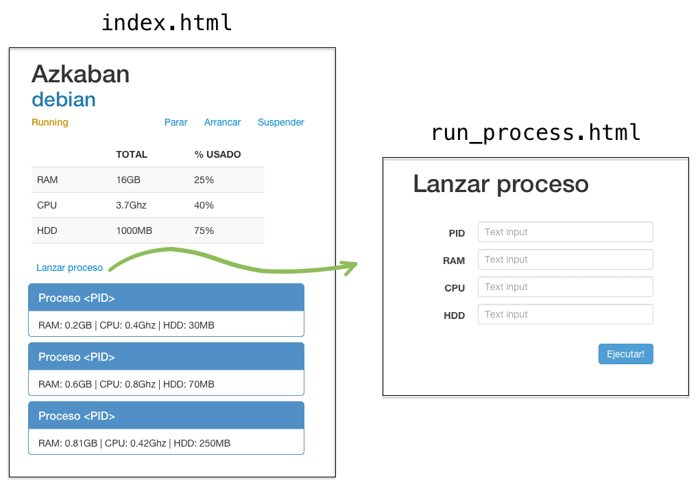

# UT2-A8: Gestionando mi máquina virtual vía web

La actividad consiste en hacer una web con Python para gestionar una máquina virtual.

## Repositorio GitHub

En la línea de lo que hemos trabajado en clase, tendremos el código de nuestra aplicación en un repositorio con la siguiente URL:

`https://github.com/<usuario>/imw/ut2/a8/` 

Tanto en la **máquina de desarrollo** como en la **máquina de producción** nos interesa tener acceso al proyecto en la ruta `~/webapps/vmweb`.

Para ello podemos hacer uso de los *enlaces simbólicos*:

~~~console
sdelquin@imw:~$ cd webapps/
sdelquin@imw:~/webapps$ ln -s ../imw/ut2/a8 vmweb
sdelquin@imw:~/webapps$ ls -l vmweb
lrwxrwxrwx 1 sdelquin sdelquin 13 nov 25 12:49 vmweb -> ../imw/ut2/a8
sdelquin@imw:~/webapps$
~~~

## Entorno virtual

Crear un entorno virtual con Python que llamaremos `vmweb` e instalar:

- `flask`.
- `fabric` (sólo como *dependencia de desarrollo*).

~~~console
$ pipenv install flask
$ pipenv install fabric3 --dev
~~~

## Estructura del proyecto

~~~console
sdelquin@imw:~/webapps/vmweb$ tree
.
├── fabfile.py
├── main.py
├── Pipfile
├── Pipfile.lock
├── run.sh
├── static
│   └── style.css
├── templates
│   ├── index.html
│   └── run_process.html
└── vm.py

2 directories, 9 files
sdelquin@imw:~/webapps/vmweb$
~~~

### `main.py`

~~~python
from flask import Flask
from flask import render_template
from flask import redirect
from flask import request
from vm import VirtualMachine

app = Flask(__name__)
vmachine = VirtualMachine('Azkaban', 16, 3.7, 1000, 'debian')

@app.route('/')
def index():
    return render_template('index.html', vmachine=vmachine)

@app.route('/change_status/<new_status>')
def change_status(new_status):
    # tu código aquí
    return redirect('/')

@app.route('/run_process', methods=['GET', 'POST'])
def run_process():
    if request.method == 'POST':
        # tu código aquí
        return redirect('/')
    else:
        return render_template('run_process.html')
~~~

### `vm.py`

Se proporciona el fichero [vm.py](vm.py)

## Wireframes

## Hojas de estilo

Recordar que podemos incorporar código `css` en nuestras plantillas utilizando la siguiente instrucción:

~~~html
<html>
    <head>
        <title>...</title>
        <link rel='stylesheet' type='text/css' href='/static/style.css'/>
    </head>
    <body>
        ...
    </body>
</html>
~~~

## Despliegue

Se deberá desplegar la aplicación en el servidor de producción, y deberá estar accesible a través de la url `http://vm.aluXXXX.me`

> NOTA:
> Debido a que estamos utilizando una variable global en nuestro código `vmachine`, para que la aplicación funcione bien en producción, debemos utilizar un único proceso. Por lo tanto, en el fichero `uwsgi.ini` tenemos que especificar `processes=1`.

ℹ️ Consultar apuntes de [Python para web: Instalación y configuración URL](https://github.com/sdelquin/claseando/blob/master/imw/UT1/notes/pythonconf/README.md#creaci%C3%B3n-del-hola-mundo)

## Ficheros a entregar

Además de los ficheros señalados [aquí](#estructura-del-proyecto), la carpeta deberá contener los siguientes ficheros:

- `vm.aluXXXX.me` (fichero de configuración del virtual-host Nginx)
- `supervisor.conf`

## Extras

Mostrar el botón de... | Sólo cuando la máquina está en estado...
--- | ---
Lanzar proceso | Running
Suspender | Running
Parar | Running o Suspended
Arrancar | Stopped o Suspended

## Información a entregar

Se deberá entregar la *url* al commit en el repositorio privado *GitHub* de la asignatura *IMW*, apuntando a la carpeta que contiene los [ficheros a entregar](#ficheros-a-entregar). La *url* debe tener la siguiente estructura:

~~~
https://github.com/<usuario>/imw/blob/<id del commit>/<ut>/<actividad>/
~~~

> ⚠️ Al subir la *url*, es importante crear un enlace. Es decir, poner un `href` a la *url* anterior, y no pegar el texto tal cual.
