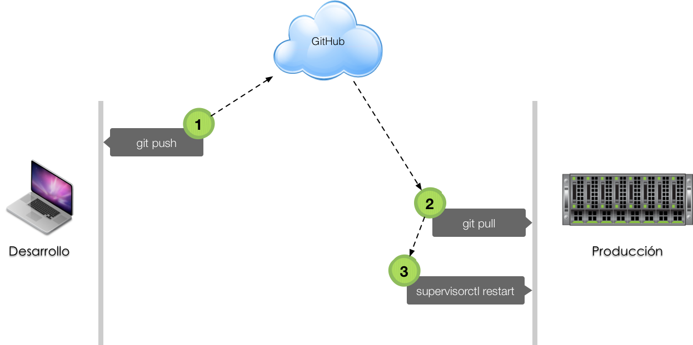

# Despliegue

El **despliegue** es el mecanismo que permite pasar un proyecto de software, desde la *máquina de desarrollo* al *servidor de producción*:

 

## Fabric

Fabric es una librería Python para **automatizar tareas a través de SSH** que permite el despliegue de aplicaciones ó tareas de administración (automatización).

### Instalación

En la máquina de desarrollo haremos lo siguiente:

~~~console
sdelquin@imw:~/webapps/myweb$ pipenv install fabric3 --dev
Installing fabric3…
Collecting fabric3
  Downloading https://files.pythonhosted.org/packages/85/14/0b4f34e1f9a351bbe0f1ddea8b12f8103e77e9b5dc7b935c25c2260fc2e5/Fabric3-1.14.post1-py3-none-any.whl (92kB)
Collecting six>=1.10.0 (from fabric3)
  Using cached https://files.pythonhosted.org/packages/67/4b/141a581104b1f6397bfa78ac9d43d8ad29a7ca43ea90a2d863fe3056e86a/six-1.11.0-py2.py3-none-any.whl
Collecting paramiko<3.0,>=2.0 (from fabric3)
  Downloading https://files.pythonhosted.org/packages/cf/ae/94e70d49044ccc234bfdba20114fa947d7ba6eb68a2e452d89b920e62227/paramiko-2.4.2-py2.py3-none-any.whl (193kB)
Collecting pyasn1>=0.1.7 (from paramiko<3.0,>=2.0->fabric3)
  Downloading https://files.pythonhosted.org/packages/d1/a1/7790cc85db38daa874f6a2e6308131b9953feb1367f2ae2d1123bb93a9f5/pyasn1-0.4.4-py2.py3-none-any.whl (72kB)
Collecting pynacl>=1.0.1 (from paramiko<3.0,>=2.0->fabric3)
  Downloading https://files.pythonhosted.org/packages/27/15/2cd0a203f318c2240b42cd9dd13c931ddd61067809fee3479f44f086103e/PyNaCl-1.3.0-cp34-abi3-manylinux1_x86_64.whl (759kB)
Collecting cryptography>=1.5 (from paramiko<3.0,>=2.0->fabric3)
  Downloading https://files.pythonhosted.org/packages/60/c7/99b33c53cf3f20a97a4c4bfd3ab66dcc93d99da0a97cc9597aa36ae6bb62/cryptography-2.4.2-cp34-abi3-manylinux1_x86_64.whl (2.1MB)
Collecting bcrypt>=3.1.3 (from paramiko<3.0,>=2.0->fabric3)
  Downloading https://files.pythonhosted.org/packages/a8/ce/1b9fe8001f95191a6254736d502fa51a2ff6bd0ffa9e290640f909b3adcb/bcrypt-3.1.4-cp34-abi3-manylinux1_x86_64.whl (51kB)
Collecting cffi>=1.4.1 (from pynacl>=1.0.1->paramiko<3.0,>=2.0->fabric3)
  Downloading https://files.pythonhosted.org/packages/51/7b/d1014289d0578c3522b2798b9cb87c65e5b36798bd3ae68a75fa1fe09e78/cffi-1.11.5-cp37-cp37m-manylinux1_x86_64.whl (421kB)
Collecting idna>=2.1 (from cryptography>=1.5->paramiko<3.0,>=2.0->fabric3)
  Downloading https://files.pythonhosted.org/packages/4b/2a/0276479a4b3caeb8a8c1af2f8e4355746a97fab05a372e4a2c6a6b876165/idna-2.7-py2.py3-none-any.whl (58kB)
Collecting asn1crypto>=0.21.0 (from cryptography>=1.5->paramiko<3.0,>=2.0->fabric3)
  Downloading https://files.pythonhosted.org/packages/ea/cd/35485615f45f30a510576f1a56d1e0a7ad7bd8ab5ed7cdc600ef7cd06222/asn1crypto-0.24.0-py2.py3-none-any.whl (101kB)
Collecting pycparser (from cffi>=1.4.1->pynacl>=1.0.1->paramiko<3.0,>=2.0->fabric3)
  Downloading https://files.pythonhosted.org/packages/68/9e/49196946aee219aead1290e00d1e7fdeab8567783e83e1b9ab5585e6206a/pycparser-2.19.tar.gz (158kB)
Building wheels for collected packages: pycparser
  Running setup.py bdist_wheel for pycparser: started
  Running setup.py bdist_wheel for pycparser: finished with status 'done'
  Stored in directory: /home/sdelquin/.cache/pipenv/wheels/f2/9a/90/de94f8556265ddc9d9c8b271b0f63e57b26fb1d67a45564511
Successfully built pycparser
Installing collected packages: six, pyasn1, pycparser, cffi, pynacl, idna, asn1crypto, cryptography, bcrypt, paramiko, fabric3
Successfully installed asn1crypto-0.24.0 bcrypt-3.1.4 cffi-1.11.5 cryptography-2.4.2 fabric3-1.14.post1 idna-2.7 paramiko-2.4.2 pyasn1-0.4.4 pycparser-2.19 pynacl-1.3.0 six-1.11.0

Adding fabric3 to Pipfile's [dev-packages]…
Pipfile.lock (2dd94e) out of date, updating to (662286)…
Locking [dev-packages] dependencies…
Locking [packages] dependencies…
Updated Pipfile.lock (2dd94e)!
Installing dependencies from Pipfile.lock (2dd94e)…
  🐍   ▉▉▉▉▉▉▉▉▉▉▉▉▉▉▉▉▉▉▉▉▉▉▉▉▉▉▉▉▉▉▉▉ 17/17 — 00:00:10
To activate this project's virtualenv, run pipenv shell.
Alternatively, run a command inside the virtualenv with pipenv run.
sdelquin@imw:~/webapps/myweb$
~~~

### Fichero de despliegue

Vamos a suponer que en la *máquina de producción*, tenemos el proyecto en `~/webapps/myweb` (como **repositorio clonado**), que ya se ha creado un **entorno virtual** con las dependencias necesarias y que tenemos una tarea funcionando en `supervisor`.

Dentro de nuestro proyecto (*en la máquina de desarrollo*), crearemos un fichero denominado `fabfile.py` que contendrá las tareas a realizar por Fabric:

~~~console
sdelquin@imw:~/webapps/myweb$ vi fabfile.py
...
~~~

~~~python
from fabric.api import env, cd, local, run

# nombre de la máquina de producción
env.hosts = ['vps.claseando.es']

def deploy():
    local('git push')
    with cd('~/webapps/myweb'):
      run('git pull')
    run('supervisorctl restart myweb')
~~~

Ahora, para desplegar nuestra aplicación, sólo tendríamos que hacer lo siguiente desde la máquina de desarrollo:

~~~console
sdelquin@imw:~/webapps/myweb$ pipenv run fab deploy
~~~
