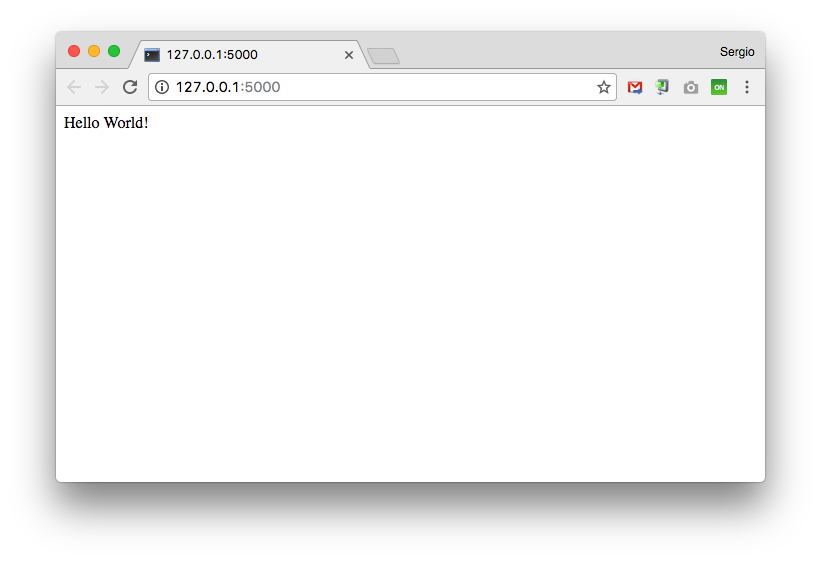

# Flask

[Flask](http://flask.pocoo.org/) es una librería de *Python*, que se define como un *microframework* para el desarrollo de aplicaciones web.

## Instalación

Desde la *máquina de desarrollo*, creamos un nuevo entorno virtual y aprovechamos para instalar **Flask**:

~~~console
sdelquin@imw:~$ cd webapps/
sdelquin@imw:~/webapps$ mkdir myweb
sdelquin@imw:~/webapps$ cd myweb
sdelquin@imw:~/webapps/myweb$ pipenv install flask
Creating a virtualenv for this project…
Pipfile: /home/sdelquin/webapps/myweb/Pipfile
Using /usr/bin/python3.7 (3.7.0) to create virtualenv…
⠋Already using interpreter /usr/bin/python3.7
Using base prefix '/usr'
/usr/local/lib/python3.7/dist-packages/virtualenv.py:1041: DeprecationWarning: the imp module is deprecated in favour of importlib; see the module's documentation for alternative uses
  import imp
New python executable in /home/sdelquin/.local/share/virtualenvs/myweb-pmIHfOGJ/bin/python3.7
Also creating executable in /home/sdelquin/.local/share/virtualenvs/myweb-pmIHfOGJ/bin/python
Installing setuptools, pip, wheel...done.

Virtualenv location: /home/sdelquin/.local/share/virtualenvs/myweb-pmIHfOGJ
Creating a Pipfile for this project…
Installing flask…
Collecting flask
  Downloading https://files.pythonhosted.org/packages/7f/e7/08578774ed4536d3242b14dacb4696386634607af824ea997202cd0edb4b/Flask-1.0.2-py2.py3-none-any.whl (91kB)
Collecting Jinja2>=2.10 (from flask)
  Using cached https://files.pythonhosted.org/packages/7f/ff/ae64bacdfc95f27a016a7bed8e8686763ba4d277a78ca76f32659220a731/Jinja2-2.10-py2.py3-none-any.whl
Collecting Werkzeug>=0.14 (from flask)
  Downloading https://files.pythonhosted.org/packages/20/c4/12e3e56473e52375aa29c4764e70d1b8f3efa6682bef8d0aae04fe335243/Werkzeug-0.14.1-py2.py3-none-any.whl (322kB)
Collecting click>=5.1 (from flask)
  Downloading https://files.pythonhosted.org/packages/fa/37/45185cb5abbc30d7257104c434fe0b07e5a195a6847506c074527aa599ec/Click-7.0-py2.py3-none-any.whl (81kB)
Collecting itsdangerous>=0.24 (from flask)
  Downloading https://files.pythonhosted.org/packages/76/ae/44b03b253d6fade317f32c24d100b3b35c2239807046a4c953c7b89fa49e/itsdangerous-1.1.0-py2.py3-none-any.whl
Collecting MarkupSafe>=0.23 (from Jinja2>=2.10->flask)
  Downloading https://files.pythonhosted.org/packages/e4/c4/adcc2d6f2ac2146cc04e076f14f1006c1de8e1e747fa067668b6573000b8/MarkupSafe-1.1.0-cp37-cp37m-manylinux1_x86_64.whl
Installing collected packages: MarkupSafe, Jinja2, Werkzeug, click, itsdangerous, flask
Successfully installed Jinja2-2.10 MarkupSafe-1.1.0 Werkzeug-0.14.1 click-7.0 flask-1.0.2 itsdangerous-1.1.0

Adding flask to Pipfile's [packages]…
Pipfile.lock not found, creating…
Locking [dev-packages] dependencies…
Locking [packages] dependencies…
Updated Pipfile.lock (662286)!
Installing dependencies from Pipfile.lock (662286)…
  🐍   ▉▉▉▉▉▉▉▉▉▉▉▉▉▉▉▉▉▉▉▉▉▉▉▉▉▉▉▉▉▉▉▉ 6/6 — 00:00:03
To activate this project's virtualenv, run pipenv shell.
Alternatively, run a command inside the virtualenv with pipenv run.
sdelquin@imw:~/webapps/myweb$
~~~

## Primera aplicación *Flask*

~~~console
sdelquin@imw:~/webapps/myweb$ vi main.py
...
~~~

~~~python
from flask import Flask
app = Flask(__name__)

@app.route('/')
def hello_world():
    return 'Hello World!'
~~~

Lanzamos nuestra aplicación:

~~~console
sdelquin@imw:~/webapps/myweb$ export FLASK_APP=main.py
sdelquin@imw:~/webapps/myweb$ export FLASK_ENV=development   # sólo en desarrollo
sdelquin@imw:~/webapps/myweb$ pipenv run flask run
 * Serving Flask app "main.py" (lazy loading)
 * Environment: development
 * Debug mode: on
 * Running on http://127.0.0.1:5000/ (Press CTRL+C to quit)
 * Restarting with stat
 * Debugger is active!
 * Debugger PIN: 175-926-059
~~~

Si ahora accedemos en el navegador a la dirección que nos indica `http://127.0.0.1:5000/`

## Mejorando las URLs

El [enrutamiento](http://flask.pocoo.org/docs/0.12/quickstart/#url-building) es el mecanismo que nos permite vincular *URLs* con funciones *Python*.

~~~python
@app.route('/')
def index():
    return 'Index Page'

@app.route('/hello')
def hello():
    return 'Hello World!'

@app.route('/user/<username>')
def show_user_profile(username):
    return 'User {}'.format(username)

@app.route('/post/<post_id>')
def show_post(post_id):
    return 'Post {}'.format(post_id)
~~~

## Petición POST

Por defecto, *Flask* entiende las peticiones *HTTP* como peticiones tipo *GET*. Si queremos enviar un formulario vía [POST](http://flask.pocoo.org/docs/0.11/quickstart/#http-methods), tenemos que hacer lo siguiente:

~~~python
from flask import request

@app.route("/login", methods=["GET", "POST"])
def login():
    if request.method == "POST":
        do_the_login(
            request.form["username"],   # el campo del formulario debe tener name="username"
            request.form["password"]    # el campo del formulario debe tener name="password"
        )
    else:
        show_the_login_form()
~~~

## Plantillas

Para que nuestra aplicación esté bien organizada, tendremos que poner el código de [las plantillas](http://flask.pocoo.org/docs/0.11/quickstart/#rendering-templates) en ficheros separados:

~~~python
from flask import render_template

@app.route("/hello/<name>")
def hello(name):
    return render_template("hello.html", name=name)
~~~

Las plantillas deben estar dentro de la carpeta `templates`. Con esto, la estructura de nuestra aplicación podría quedar así:

~~~console
sdelquin@imw:~/webapps/myweb$ tree
.
├── main.py
├── Pipfile
├── Pipfile.lock
└── templates
    └── hello.html

1 directory, 4 files
sdelquin@imw:~/webapps/myweb$
~~~

Las plantillas utilizan el lenguaje [Jinja2](http://jinja.pocoo.org/docs/dev/templates/). Vamos a ver cómo sería el código de nuestra plantilla `hello.html`:

~~~jinja
Hola {{ name }}!!
~~~

Un ejemplo de plantilla algo más elaborada, utilizando un bucle, sería la siguiente:

~~~jinja
<!DOCTYPE html>
<html lang="en">
<head>
    <title>My Webpage</title>
</head>
<body>
    <ul id="navigation">
    
        <li><a href="{{ item.href }}">{{ item.caption }}</a></li>
    
    </ul>

    <h1>My Webpage</h1>
    {{ a_variable }}

    {# a comment #}
</body>
</html>
~~~
