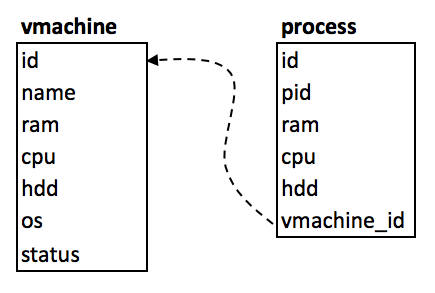

# UT3-A1: Acceso a bases de datos desde Python

Vamos a continuar con la actividad de las *máquinas virtuales*. La idea es almacenar en una base de datos *MySQL* la información siguiente:

## Creación de la base de datos

~~~sql
mysql> create database vmweb;
Query OK, 1 row affected (0,00 sec)
~~~

## Creación del usuario y gestión de permisos

~~~sql
mysql> create user emmet@localhost identified by 'brown';
Query OK, 0 rows affected (0,01 sec)

mysql> grant all privileges on vmweb.* to emmet@localhost;
Query OK, 0 rows affected (0,00 sec)

mysql>
~~~

## Creación de las tablas

Seleccionamos la base de datos para trabajar:

~~~sql
mysql> use vmweb;
Database changed
mysql>
~~~

Y creamos las tablas correspondientes:

~~~sql
create table vmachine (
    id int not null auto_increment primary key,
    name varchar(256) not null,
    ram float not null,
    cpu float not null,
    hdd float not null,
    os varchar(128) not null,
    status int not null
);

create table process (
    id int not null auto_increment primary key,
    pid int not null,
    ram float not null,
    cpu float not null,
    hdd float not null,
    vmachine_id int not null,
    foreign key (vmachine_id) references vmachine(id)
);
~~~

## Insertar la máquina virtual

Para poder trabajar con procesos, necesitamos insertar "a mano" la máquina virtual. Para ello, tenemos que entrar en el intérprete de *MySQL*:

~~~sql
mysql> insert into vmachine (name, ram, cpu, hdd, os, status) values ("Azkaban", 16, 3.7, 1000, "debian", 0);
Query OK, 1 row affected (0,00 sec)

mysql>
~~~

## Objetivo

### Desarrollo

Modificar las líneas necesarias de [la solución de la actividad anterior](https://www.dropbox.com/sh/tuinz0zog4yn7n1/AAAl6UPJ_pnAEMXgic0vzG7La?dl=0), para que los datos de la máquina virtual y de los procesos, se escriban y se lean en/desde una base de datos *MySQL*.

[Fichero `mysql.py` de acceso a base de datos](../../notes/mysql/code/mysql.py) 

[Fichero `vm.py` con las modificaciones necesarias ya hechas](vm.py)

> **NOTA**: Sólo hay que modificar algunas líneas en `main.py` y en `index.html`.

### Comprobación de funcionamiento

Lo que habremos conseguido al añadir el acceso a la base de datos es que la aplicación tenga **persistencia**, de tal forma que si el proceso *"muere"* sigamos teniendo nuestros datos a salvo y los podamos recuperar en la próxima ejecución.

Para comprobar que la persistencia está funcionando, vamos a añadir un enlace a la aplicación que reinicie el proceso de supervisor.

`main.py`
~~~python
# al principio del fichero
import os

# antes de "if __name__ == '__main__':"
@app.route("/reset_supervisor")
def reset_supervisor():
    os.system('supervisorctl restart vmweb')
    return redirect("/")
~~~

`index.html`
~~~html
<!-- colocar en un lugar visible de la página principal -->
<a href="/reset_supervisor">🔄 Resetear Supervisor</a>
~~~

### Producción

- Configurar la base de datos.
- Desplegar la aplicación usando `fabric` 
- Comprobar el correcto funcionamiento.

## Posible mejora

Ampliar el código para tener en cuenta más de una máquina virtual.

## Información a entregar

Se deberá entregar tanto la **url a la máquina de producción** con la aplicación funcionando como la **url al commit** en el repositorio privado *GitHub* de la asignatura *IMW*, apuntando a la carpeta que contiene los [ficheros a entregar](#ficheros-a-entregar). La *url* debe tener la siguiente estructura:

~~~console
https://github.com/<usuario>/imw/blob/<id del commit>/<ut>/<actividad>/
~~~

> ⚠️ Al subir la *url*, es importante crear un enlace. Es decir, poner un `href` a la *url* anterior, y no pegar el texto tal cual.
