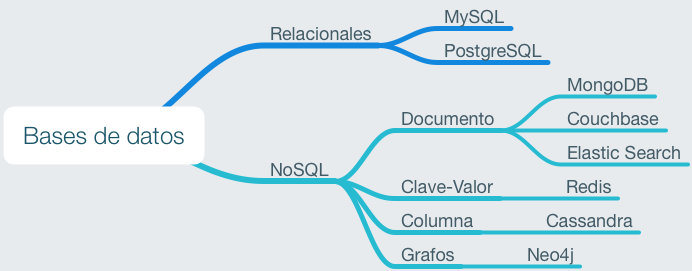
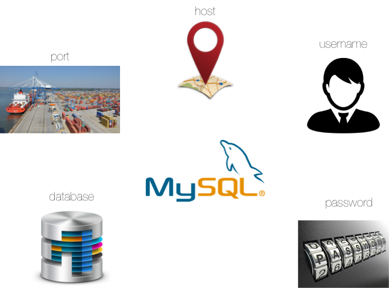

## Tipos de bases de datos

Existen multitud de tipos de bases de datos. Aquí un esquema con las más relevantes:

## Instalación de MySQL en la máquina de desarrollo

En su momento instalamos [el sistema gestor de bases de datos `MySQL`](https://github.com/sdelquin/claseando/blob/master/imw/UT1/notes/database/README.md) para la máquina de producción.

Tendremos que seguir los mismos pasos para instalarlo en la máquina de desarrollo. No es necesario que realices la instalación segura. Aunque es recomendable, estamos en desarrollo, y en teoría, la máquina no está tan expuesta.

Recuerda el password de `root` que le asignaste al servidor *MySQL*.

## MySQL y Python

El módulo que vamos a usar para conectar *Python* con bases de datos *MySQL* es [PyMySQL](https://github.com/PyMySQL/PyMySQL).

Para instalar dicho módulo habrá que ejecutar el siguiente comando:

~~~console
$ pipenv install PyMySQL
~~~

### ¿Qué datos necesito para acceder a MySQL?

## Supuesto práctico: "Mis comandos"

El supuesto práctico consiste en desarrollar una aplicación para leer por consola comandos Unix, e irlos guardando en una base de datos *MySQL*. Cada registro almacenará el **comando** y su **descripción**.

### Creación del entorno virtual

~~~console
sdelquin@imw:~$ cd webapps/
sdelquin@imw:~/webapps$ mkdir commands
sdelquin@imw:~/webapps$ cd commands
sdelquin@imw:~/webapps/commands$ pipenv install PyMySQL
Creating a virtualenv for this project…
Pipfile: /home/sdelquin/webapps/commands/Pipfile
Using /usr/bin/python3.7 (3.7.0) to create virtualenv…
⠹Already using interpreter /usr/bin/python3.7
Using base prefix '/usr'
/usr/local/lib/python3.7/dist-packages/virtualenv.py:1041: DeprecationWarning: the imp module is deprecated in favour of importlib; see the module's documentation for alternative uses
  import imp
New python executable in /home/sdelquin/.local/share/virtualenvs/commands-q6mf3pl3/bin/python3.7
Also creating executable in /home/sdelquin/.local/share/virtualenvs/commands-q6mf3pl3/bin/python
Installing setuptools, pip, wheel...done.

Virtualenv location: /home/sdelquin/.local/share/virtualenvs/commands-q6mf3pl3
Creating a Pipfile for this project…
Installing PyMySQL…
Collecting pymysql
  Downloading https://files.pythonhosted.org/packages/a7/7d/682c4a7da195a678047c8f1c51bb7682aaedee1dca7547883c3993ca9282/PyMySQL-0.9.2-py2.py3-none-any.whl (47kB)
Collecting cryptography (from pymysql)
  Using cached https://files.pythonhosted.org/packages/60/c7/99b33c53cf3f20a97a4c4bfd3ab66dcc93d99da0a97cc9597aa36ae6bb62/cryptography-2.4.2-cp34-abi3-manylinux1_x86_64.whl
Collecting idna>=2.1 (from cryptography->pymysql)
  Downloading https://files.pythonhosted.org/packages/14/2c/cd551d81dbe15200be1cf41cd03869a46fe7226e7450af7a6545bfc474c9/idna-2.8-py2.py3-none-any.whl (58kB)
Collecting cffi!=1.11.3,>=1.7 (from cryptography->pymysql)
  Using cached https://files.pythonhosted.org/packages/51/7b/d1014289d0578c3522b2798b9cb87c65e5b36798bd3ae68a75fa1fe09e78/cffi-1.11.5-cp37-cp37m-manylinux1_x86_64.whl
Collecting six>=1.4.1 (from cryptography->pymysql)
  Downloading https://files.pythonhosted.org/packages/73/fb/00a976f728d0d1fecfe898238ce23f502a721c0ac0ecfedb80e0d88c64e9/six-1.12.0-py2.py3-none-any.whl
Collecting asn1crypto>=0.21.0 (from cryptography->pymysql)
  Using cached https://files.pythonhosted.org/packages/ea/cd/35485615f45f30a510576f1a56d1e0a7ad7bd8ab5ed7cdc600ef7cd06222/asn1crypto-0.24.0-py2.py3-none-any.whl
Collecting pycparser (from cffi!=1.11.3,>=1.7->cryptography->pymysql)
Installing collected packages: idna, pycparser, cffi, six, asn1crypto, cryptography, pymysql
Successfully installed asn1crypto-0.24.0 cffi-1.11.5 cryptography-2.4.2 idna-2.8 pycparser-2.19 pymysql-0.9.2 six-1.12.0

Adding PyMySQL to Pipfile's [packages]…
Pipfile.lock not found, creating…
Locking [dev-packages] dependencies…
Locking [packages] dependencies…
Updated Pipfile.lock (039e13)!
Installing dependencies from Pipfile.lock (039e13)…
  🐍   ▉▉▉▉▉▉▉▉▉▉▉▉▉▉▉▉▉▉▉▉▉▉▉▉▉▉▉▉▉▉▉▉ 7/7 — 00:00:04
To activate this project's virtualenv, run pipenv shell.
Alternatively, run a command inside the virtualenv with pipenv run.
sdelquin@imw:~/webapps/commands$
~~~

### Setup de la base de datos

~~~sql
sdelquin@imw:~$ sudo mysql
Welcome to the MySQL monitor.  Commands end with ; or \g.
Your MySQL connection id is 5
Server version: 5.7.24-0ubuntu0.18.04.1 (Ubuntu)

Copyright (c) 2000, 2018, Oracle and/or its affiliates. All rights reserved.

Oracle is a registered trademark of Oracle Corporation and/or its
affiliates. Other names may be trademarks of their respective
owners.

Type 'help;' or '\h' for help. Type '\c' to clear the current input statement.

mysql>
~~~

Vamos a realizar las siguientes acciones:
- Crear una base de datos denominada `commands`.
- Crear un usuario `aragorn` con contraseña `arazorn`.
- Conceder todos los permisos posibles a `aragorn` sobre `commands`.
- Crear una tabla `commands`.

~~~sql
mysql> create database commands;
Query OK, 1 row affected (0.00 sec)

mysql> create user aragorn@localhost identified by 'arazorn';
Query OK, 0 rows affected (0.00 sec)

mysql> grant all privileges on commands.* to aragorn@localhost;
Query OK, 0 rows affected (0.00 sec)

mysql> use commands;
Database changed
mysql> create table commands (name varchar(256) not null, description varchar(512), primary key (name));
Query OK, 0 rows affected (0.07 sec)

mysql>
~~~

### Código

Creamos un fichero `main.py`:

~~~console
sdelquin@imw:~/webapps/commands$ vi main.py
...
~~~

~~~python
import pymysql.cursors

# Connect to the database
connection = pymysql.connect(
    host='localhost',
    port=3306,
    user='aragorn',
    password='arazorn',
    db='commands',
    charset='utf8mb4',
    cursorclass=pymysql.cursors.DictCursor,
    autocommit=True
)

cmd = input('Introduzca el comando: ')
desc = input('Introduzca la descripción: ')

with connection.cursor() as cursor:
    sql = f"insert into commands values ('{cmd}', '{desc}')"
    cursor.execute(sql)

with connection.cursor() as cursor:
    sql = 'select * from commands order by name'
    cursor.execute(sql)
    result = cursor.fetchall()
    print(result)
~~~

### Ejecutando nuestro programa

Activamos el entorno virtual:

~~~console
sdelquin@imw:~/webapps/commands$ pipenv shell
Launching subshell in virtual environment…
sdelquin@imw:~/webapps/commands$  . /home/sdelquin/.local/share/virtualenvs/commands-q6mf3pl3/bin/activate
(commands) sdelquin@imw:~/webapps/commands$
~~~

Ejecutamos el programa varias veces para ir insertando diferentes comandos:

~~~console
(commands) sdelquin@imw:~/webapps/commands$ python main.py
Introduzca el comando: ls
Introduzca la descripción: Listar el contenido de un directorio
[{'name': 'ls', 'description': 'Listar el contenido de un directorio'}]

(commands) sdelquin@imw:~/webapps/commands$ python main.py
Introduzca el comando: cd
Introduzca la descripción: Cambiar a otro directorio
[{'name': 'cd', 'description': 'Cambiar a otro directorio'}, {'name': 'ls', 'description': 'Listar el contenido de un directorio'}]
(commands) sdelquin@imw:~/webapps/commands$

(commands) sdelquin@imw:~/webapps/commands$ python main.py
Introduzca el comando: who
Introduzca la descripción: Persona que está ejecutando la shell
[{'name': 'cd', 'description': 'Cambiar a otro directorio'}, {'name': 'ls', 'description': 'Listar el contenido de un directorio'}, {'name': 'who', 'description': 'Persona que está ejecutando la shell'}]
(commands) sdelquin@imw:~/webapps/commands$
~~~

### Reorganizando el código

Vamos a dividir el fichero `main.py` en dos:

~~~console
sdelquin@imw:~/webapps/commands$ tree
.
├── main.py
├── mysql.py
├── Pipfile
└── Pipfile.lock

0 directories, 4 files
sdelquin@imw:~/webapps/commands$
~~~

En el fichero `mysql.py` creamos una clase llamada `DB` para empaquetar los métodos que necesitamos de acceso a base de datos:

~~~python
import pymysql.cursors

class DB():
    def _make_connection(self):
        self.connection = pymysql.connect(
            host='localhost',
            port=3306,
            user=self.username,
            password=self.password,
            db=self.database,
            charset='utf8mb4',
            cursorclass=pymysql.cursors.DictCursor,
            autocommit=True
        )

    def __init__(self, username, password, database):
        self.username = username
        self.password = password
        self.database = database
        self._make_connection()

    def run(self, sql):
        if not self.connection.open:
            self._make_connection()

        with self.connection.cursor() as cursor:
            cursor.execute(sql)
            if sql.startswith('select'):
                return cursor.fetchall()

~~~

En el fichero `main.py` quedaría el resto de la aplicación:

~~~python
from mysql import DB

db = DB('aragorn', 'arazorn', 'commands')

cmd = input('Introduzca el comando: ')
desc = input('Introduzca la descripción: ')

sql = f"insert into commands values ('{cmd}', '{desc}')"
db.run(sql)

sql = 'select * from commands order by name'
print(db.run(sql))
~~~

Ahora podemos volver a probar nuestro programa:

~~~console
sdelquin@imw:~/webapps/commands$ pipenv run python main.py
Introduzca el comando: rm
Introduzca la descripción: Borra archivos y/o directorios
[{'name': 'cd', 'description': 'Cambiar a otro directorio'}, {'name': 'ls', 'description': 'Listar el contenido de un directorio'}, {'name': 'rm', 'description': 'Borra archivos y/o directorios'}, {'name': 'who', 'description': 'Persona que está ejecutando la shell'}]
sdelquin@imw:~/webapps/commands$
~~~
