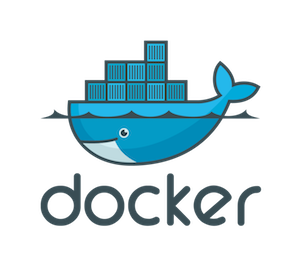
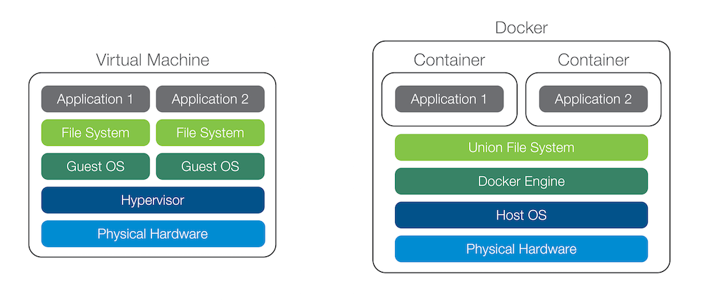

# Docker

 

## ¿Qué es Docker?

- Docker es un proyecto de **código abierto**.
- Automatiza el despliegue de aplicaciones dentro de **contenedores** de software.
- Proporciona una **capa adicional de abstracción** y automatización de virtualización a nivel de sistema operativo en Linux.
- Utiliza características de aislamiento de recursos del kernel Linux.
- Permite que "contenedores" independientes se ejecuten dentro de **una sola instancia de Linux**, evitando la sobrecarga de iniciar y mantener máquinas virtuales.

 

Docker provee dos *sabores* de su plataforma:

- [Docker Community Edition](https://www.docker.com/community-edition) enfocado a desarrolladores y pequeños equipos de trabajo. Es *gratuito*. Conocido como `Docker CE`.
- [Docker Entreprise Edition](https://www.docker.com/enterprise-edition) es una plataforma con infraestructura, contenedores y plugins totalmente certificados. Es *de pago*. Conocido como `Docker EE`.

## Instalación de Docker

Desde la **máquina de producción**, haremos lo siguiente:

Eliminar las versiones previas de Docker que pudieran existir:

~~~console
sdelquin@claseando:~$ sudo apt remove docker docker-engine docker.io containerd runc
Leyendo lista de paquetes... Hecho
Creando árbol de dependencias
Leyendo la información de estado... Hecho
El paquete «docker-engine» no está instalado, no se eliminará
El paquete «containerd» no está instalado, no se eliminará
El paquete «docker» no está instalado, no se eliminará
El paquete «runc» no está instalado, no se eliminará
El paquete «docker.io» no está instalado, no se eliminará
Los paquetes indicados a continuación se instalaron de forma automática y ya no son necesarios.
  dh-python grub-pc-bin libpython3-dev libpython3.6-dev python-pip-whl python3-dev python3-keyring
  python3-keyrings.alt python3-secretstorage python3-wheel python3-xdg python3.6-dev
Utilice «sudo apt autoremove» para eliminarlos.
0 actualizados, 0 nuevos se instalarán, 0 para eliminar y 123 no actualizados.
sdelquin@claseando:~$
~~~

Actualizamos el listado de paquetes:

~~~console
sdelquin@claseando:~$ sudo apt update
Obj:1 http://ppa.launchpad.net/certbot/certbot/ubuntu bionic InRelease
Obj:3 http://security.ubuntu.com/ubuntu bionic-security InRelease
Obj:2 http://ams2.mirrors.digitalocean.com/ubuntu bionic InRelease
Obj:4 http://ams2.mirrors.digitalocean.com/ubuntu bionic-updates InRelease
Obj:5 http://ams2.mirrors.digitalocean.com/ubuntu bionic-backports InRelease
Leyendo lista de paquetes... Hecho
Creando árbol de dependencias
Leyendo la información de estado... Hecho
Se pueden actualizar 123 paquetes. Ejecute «apt list --upgradable» para verlos.
sdelquin@claseando:~$
~~~

Instalamos los paquetes necesarios para que `apt` pueda usar repositorios sobre HTTPS:

~~~console
sdelquin@claseando:~$ sudo apt install -y apt-transport-https ca-certificates curl software-properties-common
Leyendo lista de paquetes... Hecho
2 actualizados, 1 nuevos se instalarán, 0 para eliminar y 121 no actualizados.
Se necesita descargar 33,6 kB de archivos.
Se utilizarán 152 kB de espacio de disco adicional después de esta operación.
Des:1 http://ams2.mirrors.digitalocean.com/ubuntu bionic-updates/universe amd64 apt-transport-https all 1.6.6 [1.692 B]
Des:2 http://ams2.mirrors.digitalocean.com/ubuntu bionic-updates/main amd64 software-properties-common all 0.96.24.32.7 [9.908 B]
Des:3 http://ams2.mirrors.digitalocean.com/ubuntu bionic-updates/main amd64 python3-software-properties all 0.96.24.32.7 [22,0 kB]
Descargados 33,6 kB en 1s (49,2 kB/s)
Seleccionando el paquete apt-transport-https previamente no seleccionado.
(Leyendo la base de datos ... 133816 ficheros o directorios instalados actualmente.)
Preparando para desempaquetar .../apt-transport-https_1.6.6_all.deb ...
Desempaquetando apt-transport-https (1.6.6) ...
Preparando para desempaquetar .../software-properties-common_0.96.24.32.7_all.deb ...
Desempaquetando software-properties-common (0.96.24.32.7) sobre (0.96.24.32.5) ...
Preparando para desempaquetar .../python3-software-properties_0.96.24.32.7_all.deb ...
Desempaquetando python3-software-properties (0.96.24.32.7) sobre (0.96.24.32.5) ...
Configurando apt-transport-https (1.6.6) ...
Procesando disparadores para man-db (2.8.3-2) ...
Configurando python3-software-properties (0.96.24.32.7) ...
Procesando disparadores para dbus (1.12.2-1ubuntu1) ...
Configurando software-properties-common (0.96.24.32.7) ...
sdelquin@claseando:~$
~~~

Añadimos la clave oficial GPG de Docker:

~~~console
sdelquin@claseando:~$ curl -fsSL https://download.docker.com/linux/ubuntu/gpg | sudo apt-key add -
OK
sdelquin@claseando:~$
~~~

Comprobación de clave:

~~~console
sdelquin@claseando:~$ sudo apt-key fingerprint 0EBFCD88
pub   rsa4096 2017-02-22 [SCEA]
      9DC8 5822 9FC7 DD38 854A  E2D8 8D81 803C 0EBF CD88
uid           [ unknown] Docker Release (CE deb) <docker@docker.com>
sub   rsa4096 2017-02-22 [S]

sdelquin@claseando:~$
~~~

Añadimos el repositorio de Docker:

~~~console
sdelquin@claseando:~$ sudo add-apt-repository "deb [arch=amd64] https://download.docker.com/linux/ubuntu $(lsb_release -cs) stable"
Obj:1 http://ppa.launchpad.net/certbot/certbot/ubuntu bionic InRelease
Des:2 http://security.ubuntu.com/ubuntu bionic-security InRelease [83,2 kB]
Des:3 https://download.docker.com/linux/ubuntu bionic InRelease [64,4 kB]
Des:4 http://security.ubuntu.com/ubuntu bionic-security/main Sources [67,5 kB]
Des:6 http://security.ubuntu.com/ubuntu bionic-security/main amd64 Packages [237 kB]
Obj:5 http://ams2.mirrors.digitalocean.com/ubuntu bionic InRelease
Des:7 http://security.ubuntu.com/ubuntu bionic-security/main Translation-en [89,3 kB]
Des:8 http://security.ubuntu.com/ubuntu bionic-security/universe amd64 Packages [110 kB]
Des:9 http://security.ubuntu.com/ubuntu bionic-security/universe Translation-en [62,4 kB]
Obj:10 http://ams2.mirrors.digitalocean.com/ubuntu bionic-updates InRelease
Des:12 https://download.docker.com/linux/ubuntu bionic/stable amd64 Packages [3.161 B]
Obj:11 http://ams2.mirrors.digitalocean.com/ubuntu bionic-backports InRelease
Descargados 717 kB en 1s (728 kB/s)
Leyendo lista de paquetes... Hecho
sdelquin@claseando:~$
~~~

Actualizamos el listado de paquetes:

~~~console
sdelquin@claseando:~$ sudo apt update
Obj:1 http://security.ubuntu.com/ubuntu bionic-security InRelease
Obj:2 http://ppa.launchpad.net/certbot/certbot/ubuntu bionic InRelease
Obj:3 https://download.docker.com/linux/ubuntu bionic InRelease
Obj:4 http://ams2.mirrors.digitalocean.com/ubuntu bionic InRelease
Obj:5 http://ams2.mirrors.digitalocean.com/ubuntu bionic-updates InRelease
Obj:6 http://ams2.mirrors.digitalocean.com/ubuntu bionic-backports InRelease
Leyendo lista de paquetes... Hecho
Creando árbol de dependencias
Leyendo la información de estado... Hecho
Se pueden actualizar 121 paquetes. Ejecute «apt list --upgradable» para verlos.
sdelquin@claseando:~$
~~~

Instalamos el paquete:

~~~console
sdelquin@claseando:~$ sudo apt install -y docker-ce
Leyendo lista de paquetes... Hecho
Seleccionando el paquete docker-ce-cli previamente no seleccionado.
Preparando para desempaquetar .../5-docker-ce-cli_5%3a18.09.0~3-0~ubuntu-bionic_amd64.deb ...
Desempaquetando docker-ce-cli (5:18.09.0~3-0~ubuntu-bionic) ...
Seleccionando el paquete docker-ce previamente no seleccionado.
Preparando para desempaquetar .../6-docker-ce_5%3a18.09.0~3-0~ubuntu-bionic_amd64.deb ...
Desempaquetando docker-ce (5:18.09.0~3-0~ubuntu-bionic) ...
Configurando aufs-tools (1:4.9+20170918-1ubuntu1) ...
Configurando containerd.io (1.2.0-1) ...
Created symlink /etc/systemd/system/multi-user.target.wants/containerd.service → /lib/systemd/system/containerd.service.
Procesando disparadores para ureadahead (0.100.0-20) ...
Configurando cgroupfs-mount (1.4) ...
Procesando disparadores para libc-bin (2.27-3ubuntu1) ...
Procesando disparadores para systemd (237-3ubuntu10.9) ...
Configurando libltdl7:amd64 (2.4.6-2) ...
Procesando disparadores para man-db (2.8.3-2) ...
Configurando docker-ce-cli (5:18.09.0~3-0~ubuntu-bionic) ...
Configurando pigz (2.4-1) ...
Configurando docker-ce (5:18.09.0~3-0~ubuntu-bionic) ...
update-alternatives: utilizando /usr/bin/dockerd-ce para proveer /usr/bin/dockerd (dockerd) en modo automático
Created symlink /etc/systemd/system/multi-user.target.wants/docker.service → /lib/systemd/system/docker.service.
Procesando disparadores para ureadahead (0.100.0-20) ...
Procesando disparadores para libc-bin (2.27-3ubuntu1) ...
sdelquin@claseando:~$
~~~

Verificamos que todo se ha instalado correctamente lanzando un contenedor de ejemplo:

~~~console
sdelquin@claseando:~$ sudo docker container run hello-world
Unable to find image 'hello-world:latest' locally
latest: Pulling from library/hello-world
1b930d010525: Pull complete
Digest: sha256:2557e3c07ed1e38f26e389462d03ed943586f744621577a99efb77324b0fe535
Status: Downloaded newer image for hello-world:latest

Hello from Docker!
This message shows that your installation appears to be working correctly.

To generate this message, Docker took the following steps:
 1. The Docker client contacted the Docker daemon.
 2. The Docker daemon pulled the "hello-world" image from the Docker Hub.
    (amd64)
 3. The Docker daemon created a new container from that image which runs the
    executable that produces the output you are currently reading.
 4. The Docker daemon streamed that output to the Docker client, which sent it
    to your terminal.

To try something more ambitious, you can run an Ubuntu container with:
 $ docker run -it ubuntu bash

Share images, automate workflows, and more with a free Docker ID:
 https://hub.docker.com/

For more examples and ideas, visit:
 https://docs.docker.com/get-started/

sdelquin@claseando:~$
~~~

### Comprobando el servicio

~~~console
sdelquin@claseando:~$ sudo systemctl status docker
● docker.service - Docker Application Container Engine
   Loaded: loaded (/lib/systemd/system/docker.service; enabled; vendor preset: enabled)
   Active: active (running) since Wed 2019-01-09 18:20:59 UTC; 8min ago
     Docs: https://docs.docker.com
 Main PID: 9443 (dockerd)
    Tasks: 10
   CGroup: /system.slice/docker.service
           └─9443 /usr/bin/dockerd -H unix://

ene 09 18:20:59 claseando dockerd[9443]: time="2019-01-09T18:20:59.124104936Z" level=warning msg="Your kernel does not s
ene 09 18:20:59 claseando dockerd[9443]: time="2019-01-09T18:20:59.127510776Z" level=info msg="Loading containers: start
ene 09 18:20:59 claseando dockerd[9443]: time="2019-01-09T18:20:59.343147941Z" level=info msg="Default bridge (docker0)
ene 09 18:20:59 claseando dockerd[9443]: time="2019-01-09T18:20:59.452697155Z" level=info msg="Loading containers: done.
ene 09 18:20:59 claseando dockerd[9443]: time="2019-01-09T18:20:59.623094995Z" level=info msg="Docker daemon" commit=4d6
ene 09 18:20:59 claseando dockerd[9443]: time="2019-01-09T18:20:59.624096222Z" level=info msg="Daemon has completed init
ene 09 18:20:59 claseando systemd[1]: Started Docker Application Container Engine.
ene 09 18:20:59 claseando dockerd[9443]: time="2019-01-09T18:20:59.668833952Z" level=info msg="API listen on /var/run/do
ene 09 18:21:41 claseando dockerd[9443]: time="2019-01-09T18:21:41.610898732Z" level=info msg="ignoring event" module=li
ene 09 18:28:04 claseando dockerd[9443]: time="2019-01-09T18:28:04.925489087Z" level=info msg="ignoring event" module=li
lines 1-19/19 (END)
~~~

[Tutorial oficial de instalación de Ubuntu CE para Ubuntu](https://docs.docker.com/engine/installation/linux/docker-ce/ubuntu/) 

## Instalación de Docker Compose

*Docker Compose* es una herramienta que permite levantar y gestionar microservicios Docker conectados entre sí de manera sencilla.

Descargamos el ejecutable:

~~~console
sdelquin@claseando:~$ sudo curl -L "https://github.com/docker/compose/releases/download/1.23.2/docker-compose-$(uname -s)-$(uname -m)" -o /usr/local/bin/docker-compose
  % Total    % Received % Xferd  Average Speed   Time    Time     Time  Current
                                 Dload  Upload   Total   Spent    Left  Speed
100   617    0   617    0     0   1229      0 --:--:-- --:--:-- --:--:--  1226
100 11.2M  100 11.2M    0     0  6102k      0  0:00:01  0:00:01 --:--:-- 14.5M
sdelquin@claseando:~$
~~~

Damos permisos de ejecución:

~~~console
sdelquin@claseando:~$ sudo chmod +x /usr/local/bin/docker-compose
sdelquin@claseando:~$
~~~

Testeamos la instalación:

~~~console
sdelquin@claseando:~$ docker-compose --version
docker-compose version 1.23.2, build 1110ad01
sdelquin@claseando:~$
~~~

[Tutorial oficial de instalación de Docker Compose](https://docs.docker.com/compose/install/) 

## Pasos después de la instalación

Por defecto, `docker` sólo puede ser utilizado por el usuario `root`. Vamos a permitir que otros usuarios no privilegiados puedan utilizarlo.

Añadimos el usuario actual al grupo `docker` (creado en la instalación previa):

~~~console
sdelquin@claseando:~$ sudo usermod -aG docker $USER
sdelquin@claseando:~$
~~~

**NOTA:** Ahora debemos **SALIR DE LA SESIÓN Y VOLVER A ENTRAR** para que los cambios surtan efecto:

Comprobamos que podemos usar el comando `docker` desde un usuario no privilegiado:

~~~console
sdelquin@claseando:~$ docker run hello-world

Hello from Docker!
This message shows that your installation appears to be working correctly.

To generate this message, Docker took the following steps:
 1. The Docker client contacted the Docker daemon.
 2. The Docker daemon pulled the "hello-world" image from the Docker Hub.
    (amd64)
 3. The Docker daemon created a new container from that image which runs the
    executable that produces the output you are currently reading.
 4. The Docker daemon streamed that output to the Docker client, which sent it
    to your terminal.

To try something more ambitious, you can run an Ubuntu container with:
 $ docker run -it ubuntu bash

Share images, automate workflows, and more with a free Docker ID:
 https://hub.docker.com/

For more examples and ideas, visit:
 https://docs.docker.com/get-started/

sdelquin@claseando:~$
~~~

[Tutorial para post-instalación de Docker en Linux](https://docs.docker.com/engine/installation/linux/linux-postinstall/) 
