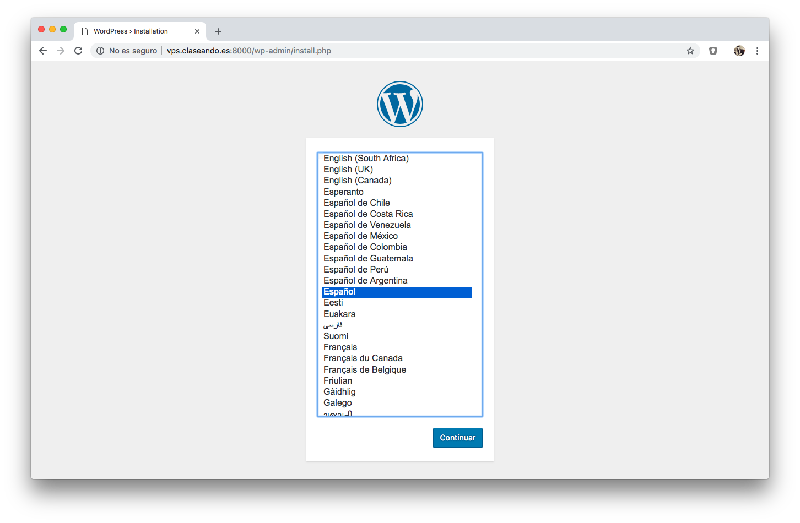
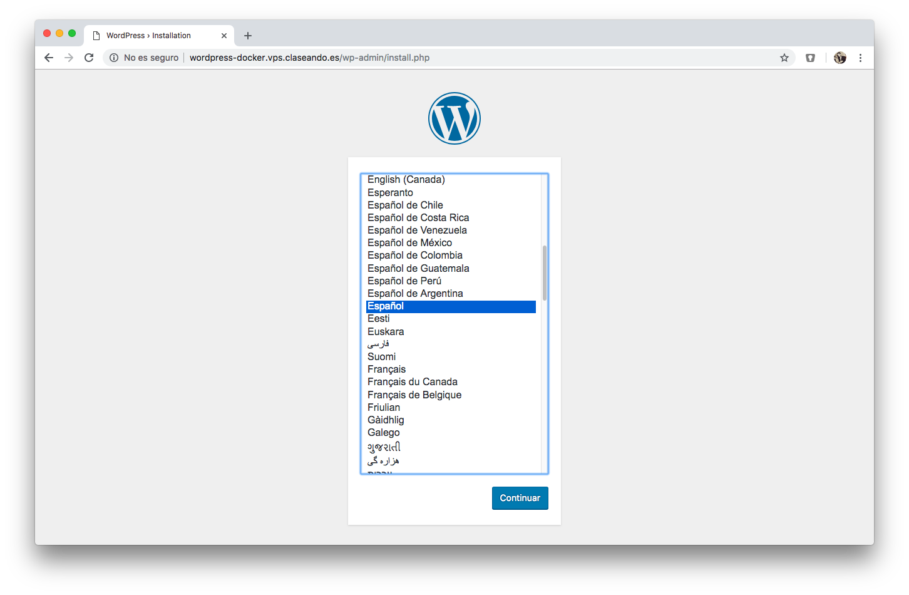

# Dockerizando Wordpress

En primer lugar vamos a crear un fichero para componer nuestros contenedores:

~~~console
sdelquin@claseando:~$ mkdir -p docker/wordpress
sdelquin@claseando:~$ cd docker/wordpress
sdelquin@claseando:~/docker/wordpress$ vi docker-compose.yml
~~~

> Contenido:

~~~yaml
version: '3.3'

services:
   db:
     image: mysql:5.7
     volumes:
       - db_data:/var/lib/mysql
     restart: always
     environment:
       MYSQL_ROOT_PASSWORD: somewordpress
       MYSQL_DATABASE: wordpress
       MYSQL_USER: wordpress
       MYSQL_PASSWORD: wordpress

   wordpress:
     depends_on:
       - db
     image: wordpress:latest
     ports:
       - "8000:80"
     restart: always
     environment:
       WORDPRESS_DB_HOST: db:3306
       WORDPRESS_DB_USER: wordpress
       WORDPRESS_DB_PASSWORD: wordpress
volumes:
    db_data: {}
~~~

Ahora lanzamos los servicios:

~~~console
sdelquin@claseando:~/docker/wordpress$ docker-compose up
...
Creating wordpress_db_1 ... done
Creating wordpress_wordpress_1 ... done
Attaching to wordpress_db_1, wordpress_wordpress_1
...
~~~

Si accedemos al puerto `8080` en la dirección de **nuestra máquina de producción**, podremos ver que accedemos al instalador de Wordpress: http://vps.claseando.es:8000

 

Paramos el `docker-compose` pulsando <kbd>CTRL-C</kbd>

~~~console
...
Killing wordpress_wordpress_1  ... done
Killing wordpress_db_1         ... done
sdelquin@claseando:~/docker/wordpress$
~~~

## Analizando el volumen

Para que los datos sean persistentes entre distintas ejecuciones del contenedor, hemos definido un volumen `db_data`.

En primer lugar pedimos un listado de los volúmenes existentes:

~~~console
sdelquin@claseando:~/docker/wordpress$ docker volume ls
DRIVER              VOLUME NAME
local               537475acd5b6ee21f744f81344b8560e9d56ac5f252f289188eaa8b50b26eaf7
local               wordpress_db_data
sdelquin@claseando:~/docker/wordpress$
~~~

Ahora inspeccionamos nuestro volumen:

~~~console
sdelquin@claseando:~/docker/wordpress$ docker volume inspect wordpress_db_data
[
    {
        "CreatedAt": "2019-01-09T18:45:37Z",
        "Driver": "local",
        "Labels": {
            "com.docker.compose.project": "wordpress",
            "com.docker.compose.version": "1.23.2",
            "com.docker.compose.volume": "db_data"
        },
        "Mountpoint": "/var/lib/docker/volumes/wordpress_db_data/_data",
        "Name": "wordpress_db_data",
        "Options": null,
        "Scope": "local"
    }
]
sdelquin@claseando:~/docker/wordpress$
~~~

## Configuración Nginx

No es agradable tener que acceder a una *url* a través de un puerto, así que vamos a configurar nuestro servidor web para acceder a *Wordpress* a través de: http://wordpress-docker.vps.claseando.es

Lo primero que debemos hacer es dejar en "background" los contenedores de Docker:

~~~console
sdelquin@claseando:~/docker/wordpress$ docker-compose up -d
Starting wordpress_db_1 ... done
Starting wordpress_wordpress_1 ... done
sdelquin@claseando:~/docker/wordpress$
~~~

A continuación creamos un virtual host para Nginx:

~~~console
sdelquin@claseando:~/docker/wordpress$ sudo vi /etc/nginx/sites-available/wordpress-docker.vps.claseando.es
...
~~~

~~~nginx
server {
    server_name wordpress-docker.vps.claseando.es;

    location / {
        proxy_pass http://127.0.0.1:8000;

        proxy_redirect     off;
        proxy_set_header   Host $host;
        proxy_set_header   X-Real-IP $remote_addr;
        proxy_set_header   X-Forwarded-For $proxy_add_x_forwarded_for;
        proxy_set_header   X-Forwarded-Host $server_name;
    }
}
~~~

Activamos el virtual host:

~~~console
sudo ln -s /etc/nginx/sites-available/wordpress-docker.vps.claseando.es /etc/nginx/sites-enabled/
~~~

Recargamos la configuración de Nginx:

~~~console
sdelquin@cloud:~$ sudo systemctl reload nginx
sdelquin@cloud:~$
~~~

Ahora podremos acceder a la web a través de la nueva URL:

  

[Tutorial para montar Wordpress con Docker Compose](https://docs.docker.com/compose/wordpress/) 
