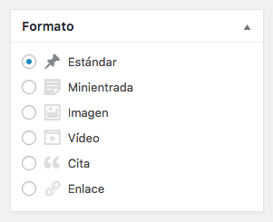
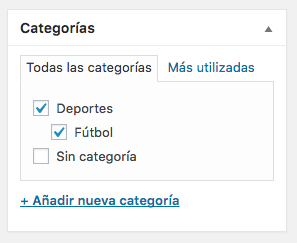
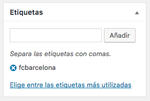
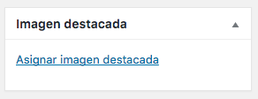

# Entradas

- El término inglés es **post**.
- Se utilizan para publicar la información en nuestro blog.

## Editor

- Modo visual (*WYSIWYG*).
- Modo HTML.

## Publicar

- Vista previa de los cambios.
- Programar la publicación.
- Editar la fecha de publicación.
- Modificar la visibilidad.

## Formato

+ Estándar.
+ Minientrada.
+ Imagen.
+ Vídeo.
+ Cita.
+ Enlace.

## Categorías

- Permiten organizar los posts (*no las páginas*).
- Tienen una *estructura jerárquica*.
- Por ejemplo, si estamos montando un periódico, podríamos tener como categorías:
    + Deportes.
        * Fútbol.
        * Baloncesto.
        * Tenis.
    + Nacional.
    + Internacional.
    + Sucesos.
    + Economía.
    + Tiempo.
- La elección de las categorías es importante, ya que afecta a las *urls*. Por ejemplo: `http://wordpress.vps.claseando.es/category/deportes/futbol/`
- Podemos hacer que en vez de `category`, aparezca otra palabra, yendo a la parte de configuración de *enlaces permanentes*.

## Etiquetas

- Permiten agrupar los posts (*no las páginas*).
- No tienen una *estructura jerárquica*.
- Por lo general, hay muchas más etiquetas que categorías.
- Las etiquetas también tienen su propia *url*: `http://wordpress.vps.claseando.es/tag/fcbarcelona/`
- Podemos hacer que en vez de `tag`, aparezca otra palabra, yendo a la parte de configuración de *enlaces permanentes*.

## Imagen destacada

- Se suelen utilizar en la difusión de redes sociales, para invitar a la lectura.

