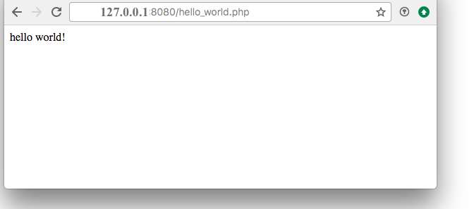

# Dockerizando Nginx + PHP-FPM

Vamos a trabajar en la **máquina de desarrollo**.

Primero debemos instalar **Docker**, siguiendo [los apuntes que ya hemos visto en clase](https://github.com/sdelquin/claseando/blob/master/imw/UT4/notes/docker/README.md).

A continuación creamos una carpeta donde guardar nuestros ficheros `php`:

~~~console
sdelquin@imw:~$ mkdir php
sdelquin@imw:~$ cd php/
sdelquin@imw:~/php$
~~~

Ahora lanzamos un contenedor de tal forma que:
1. `-p 8080:80` ➡️ Mapeamos el puerto 8080 de la máquina anfitriona al puerto 80 del contenedor.
2. `-v $PWD:/var/www/html` ➡️ Montamos un volumen, mapeando el directorio actual de la máquina anfitriona con el `wwwroot` del contenedor.

~~~console
sdelquin@imw:~/php$ docker run -p 8080:80 -v $PWD:/var/www/html richarvey/nginx-php-fpm
Unable to find image 'richarvey/nginx-php-fpm:latest' locally
latest: Pulling from richarvey/nginx-php-fpm
ab7e51e37a18: Pulling fs layer
62f3776db6e1: Pulling fs layer
8e4aa0313201: Pulling fs layer
57cb6bf51627: Pulling fs layer
34b80398c424: Pulling fs layer
7188749122e6: Pull complete
f6c30cab0f02: Pull complete
21b56674501a: Pull complete
99a6bec4af2a: Pull complete
a3991e8af4a0: Pull complete
c83908fe1d24: Pull complete
616935f01ce6: Pull complete
48df6bb5d3e8: Pull complete
3aea67e5da8f: Pull complete
e21576330cac: Pull complete
7a41addd3d74: Pull complete
0de9c5011af3: Pull complete
b7d271c20dd9: Pull complete
b2e582ce5772: Pull complete
85a9b23c5463: Pull complete
e250d1beebe0: Pull complete
0675cb731ff9: Pull complete
857c24f68c01: Pull complete
5bcd60502baa: Pull complete
057eb2725039: Pull complete
ddd5fd478956: Pull complete
7002fa9f7052: Pull complete
85782c87cadd: Pull complete
55b483985dcc: Pull complete
Digest: sha256:6786b7a9b849573534ff6d83668d9df32b4d63e0e9cfdf23a4b13e2d640fe1c5
Status: Downloaded newer image for richarvey/nginx-php-fpm:latest
2018-02-25 19:06:31,677 CRIT Set uid to user 0
2018-02-25 19:06:31,678 WARN No file matches via include "/etc/supervisor/conf.d/*.conf"
2018-02-25 19:06:31,689 INFO RPC interface 'supervisor' initialized
2018-02-25 19:06:31,690 CRIT Server 'unix_http_server' running without any HTTP authentication checking
2018-02-25 19:06:31,691 INFO supervisord started with pid 1
2018-02-25 19:06:32,697 INFO spawned: 'php-fpm' with pid 13
2018-02-25 19:06:32,699 INFO spawned: 'nginx' with pid 14
2018/02/25 19:06:32 [notice] 14#14: using the "epoll" event method
2018/02/25 19:06:32 [notice] 14#14: nginx/1.13.7
2018/02/25 19:06:32 [notice] 14#14: built by gcc 5.3.0 (Alpine 5.3.0)
2018/02/25 19:06:32 [notice] 14#14: OS: Linux 4.4.0-93-generic
2018/02/25 19:06:32 [notice] 14#14: getrlimit(RLIMIT_NOFILE): 1048576:1048576
2018/02/25 19:06:32 [notice] 14#14: start worker processes
2018/02/25 19:06:32 [notice] 14#14: start worker process 15
2018-02-25 19:06:33,903 INFO success: php-fpm entered RUNNING state, process has stayed up for > than 1 seconds (startsecs)
2018-02-25 19:06:33,904 INFO success: nginx entered RUNNING state, process has stayed up for > than 1 seconds (startsecs)
~~~

## Corrección de permisos

Dejamos ese proceso funcionando, y abrimos *una nueva terminal* en la que debemos hacer lo siguiente:

~~~console
sdelquin@imw:~$ ls -ld php
drwxrwxr-x 2 systemd-timesync systemd-journal 4096 feb 25 19:02 php
sdelquin@imw:~$
~~~

Cambiamos, de manera recursiva, los permisos de este directorio:

~~~console
sdelquin@imw:~$ sudo chown -R $USER:$USER php
[sudo] password for sdelquin:
sdelquin@imw:~$ ls -ld php
drwxrwxr-x 2 sdelquin sdelquin 4096 feb 25 19:02 php
sdelquin@imw:~$
~~~

## Edición de ficheros

Ya podemos crear nuestros ficheros `php`:

~~~console
sdelquin@imw:~/php$ echo '<?php echo("hello world!");' > hello_world.php
sdelquin@imw:~/php$
~~~

Si ahora accedemos al puerto 8080 de la máquina anfitriona, podremos ver que se procesa nuestro fichero:

 
